---
## Author
author:
  name: Пономарева Варвара Александровна
  degrees: DSc
  orcid: 0000-0002-0877-7063
  affiliation:
    - name: Российский университет дружбы народов
      country: Российская Федерация
      postal-code: 117198
      city: Москва
      address: ул. Миклухо-Маклая, д. 6
## Title
title: Отчёт по выполнению внешнего курса. Этап 1.
license: CC BY
date: today
date-format: "YYYY-MM-DD" # Example: 2025-09-06

## Fonts
mainfont: Liberation Serif
sansfont: Liberation Sans
monofont: Liberation Mono
mainfontoptions: Ligatures=TeX
romanfontoptions: Ligatures=TeX
sansfontoptions: Ligatures=TeX,Scale=MatchLowercase
monofontoptions: Scale=MatchLowercase,Scale=0.9
---

# Информация

## Докладчик

:::::::::::::: {.columns align=center}
::: {.column width="70%"}

  * Пономарева Варвара Александровна
  * студентка группы НПИ бд-02-25

:::
::: {.column width="30%"}

:::
::::::::::::::

# Цель работы

- Освоить базовые возможности Linux, выполнить задания и пройти 1 этап курса.

# Задание

- Посмотреть все предложенные видео и правильно ответить на вопросы и выполнить задания.

# 1.1 Общая информация о курсе

## Рис.1

- Выбираю правильное названия курса и отправляю ответ.

## Рис.2

- Выбираю нужные пункты и отправляю решение.

# 1.2 Как установить Linux

## Рис.3

- Отвечаю какими операционными системами я пользуюсь

## Рис.4

- Для вопроса «Что такое виртуальная машина?» выбран наиболее полный ответ: «Специальная программа для запуска одной ОС на другой ОС»

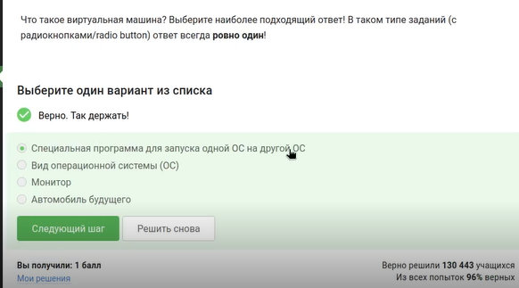

## Рис.5

- Отвечаю, что получилось запустить Linux и отправляю ответ

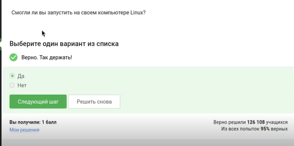

# 1.3 Осваиваем Linux

## Рис.6

- Создаю документ в предложенном текстовом редакторе, выбираю нужный шрифт и ввожу предложение

## Рис.7

- Сохраняю в формате xml и отправляю ответ

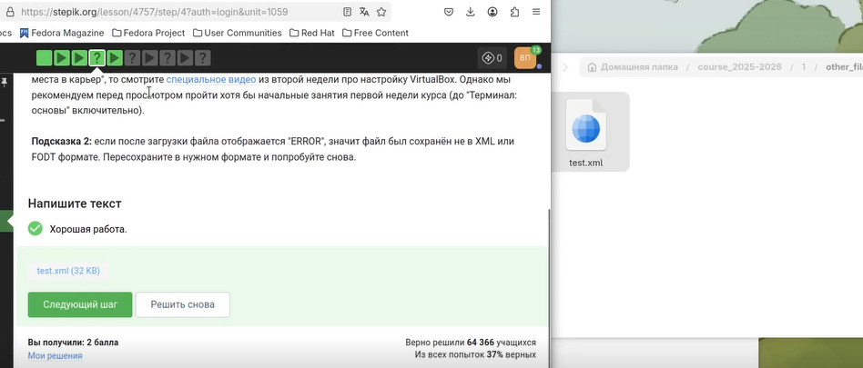

## Рис.8

- Выбираю нужное расширение deb, так как оно имеет установочные пакеты в Linux (Ubuntu)

## Рис.9

- Прописываю команду sudo dnf install, чтобы скачать vcl

## Рис.10

- Открываю скачанную программу, захожу в авторов и ввожу фамилию самого первого

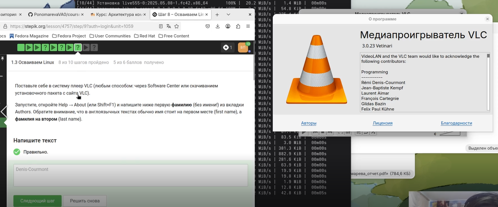

## Рис.11

- Для вопроса о назначении Update Manager выбраны правильные пункты: «Для обновления всей системы до новой версии» и «Для обновления ссылок в Software Center» (последнее — специфика данного теста)

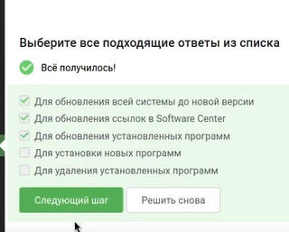

# 1.4 Terminal: основы

## Рис.12

- Выбраны все синонимы для «командной строки»: «Терминал» и «Консоль». Варианты «Ассоль» и «Термин» не являются синонимами в данном контексте.

## Рис.13

- Выбираю pwd, потому что эта команда показывает в какой директории мы сейчас находимся

## Рис.14

- Для команды ls -A --human-readable -l /some/directory отмечены эквивалентные варианты: ls -lAh /some/directory, ls -Ahl /some/directory, ls -h -A -l /some/directory

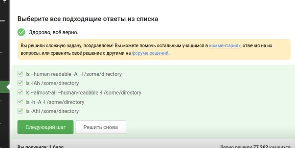

## Рис.15

- Из директории /home/bi/Documents нужно вывести содержимое /home/bi/Downloads. Выбран верный относительный путь: ls ../Downloads (подъём на уровень вверх и переход в папку Downloads)

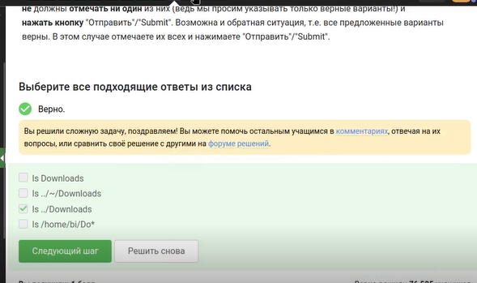

## Рис.16

- Вопрос о команде удаления директорий. Правильный ответ — rm -r (рекурсивное удаление). mkdir создаёт, mv перемещает, rm -f удаляет файлы без подтверждения, но не директории

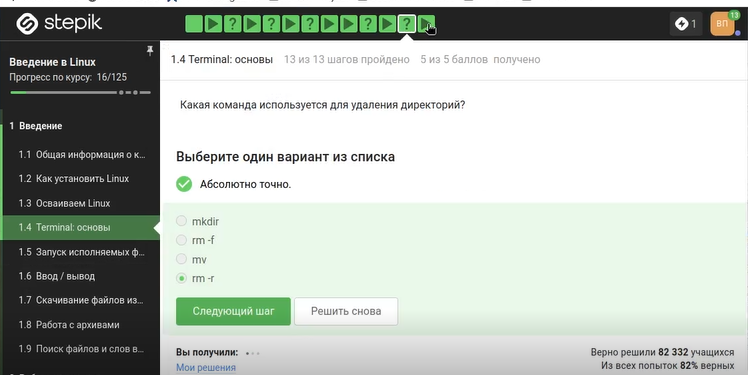

# 1.5 Запуск исполняемых файлов

## Рис.17

- Выбран верный вариант ответ

## Рис.18

- Запуск программы с символом & переводит её в фоновый режим. Этому эквивалентна последовательность: запуск программы, затем нажатие Ctrl+Z (остановка), затем команда bg (возобновление в фоне)

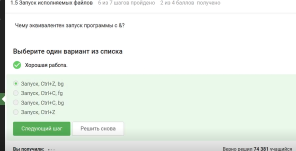

## Рис.19

- Перехожу в нужную директорию и ввожу команды, чтобы файл сделать исполняемым

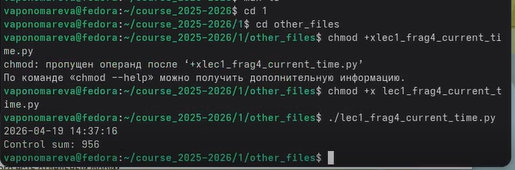

## Рис.20

- После запуска программа вывела на экран две строки: текущую дату и время (2026-04-19 14:37:16) и контрольную сумму (Control sum: 956)

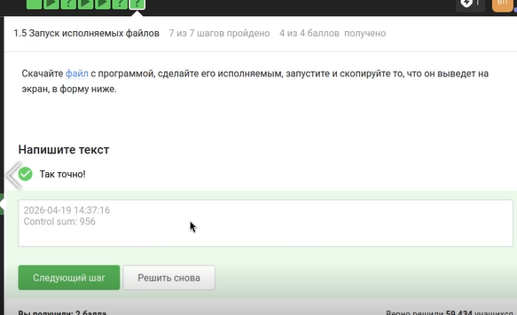

# 1.6 Ввод/вывод

## Рис.21

- Выбираю что поток ошибок выводится на экран

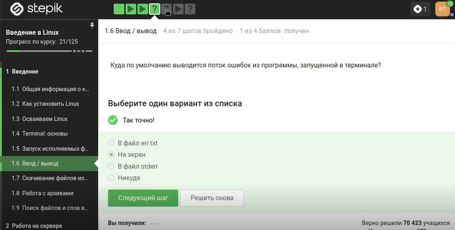

## Рис.22

- Выбраны команды, которые создают файл file.txt и записывают в него только поток ошибок (stderr) программы program: program 2> file.txt (перезапись) и program 2>> file.txt (добавление в конец)

## Рис.23

- Вопрос о том, куда попадают сообщения об ошибках (stderr) в конвейере (pipe). Правильный ответ: «Выводятся на экран», потому что по умолчанию конвейер передаёт только stdout, а stderr остаётся на терминале

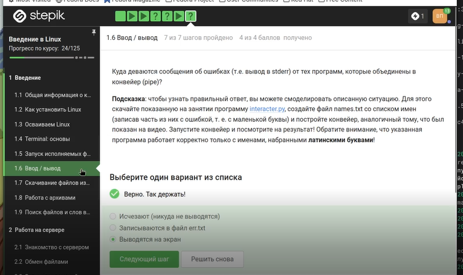

# 1.7 Скачивание файлов из интернета

## Рис.24

- Выбираю правильный ответ

## Рис.25

- Для команды wget требуется опция, подавляющая вывод любых сообщений (Resolving..., Connecting to...). Правильный ответ: -q или --quiet (от английского quiet — тихий)

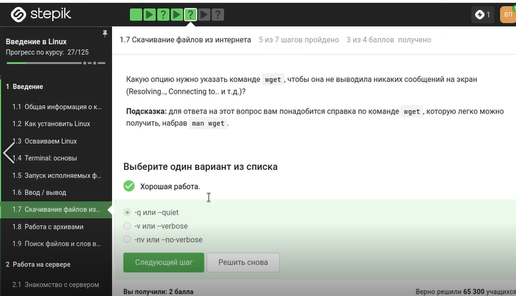

## Рис.26

- В тесте выбран правильный сценарий работы wget с заданными опциями (например, рекурсивная загрузка с ограничением по типам файлов

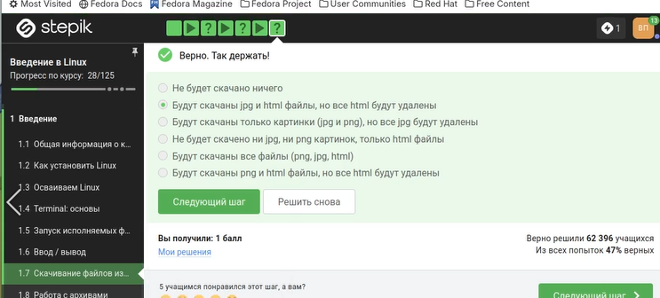

# 1.8 Работа с архивами

## Рис.27

- Вопрос об отличии gzip от zip при использовании по умолчанию. Правильный ответ: gzip удаляет архив после его распаковки (если не использовать опцию -k)

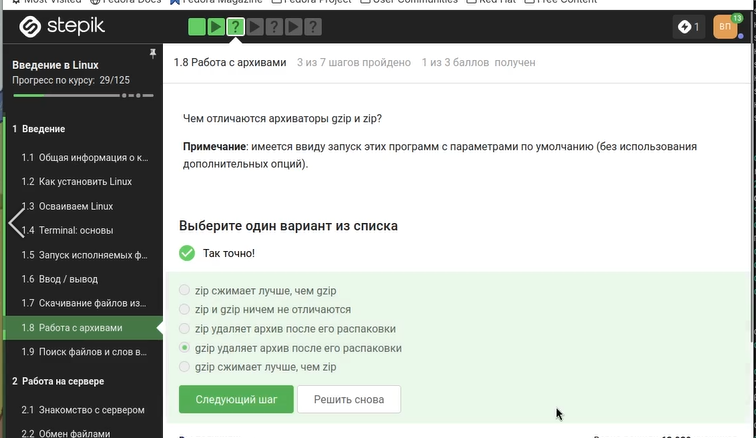

## Рис.28

- Выбраны архиваторы, способные создать архив из директории: zip (может упаковать папку рекурсивно) и tar (создаёт tar-архив, который затем можно сжать

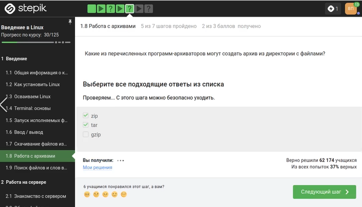

## Рис.29

- Для распаковки архива .tar.gz используется комбинация опций tar -xzf: -x (extract), -z (через gzip), -f (файл)

# 1.9 Поиск файлов и слов в файлах

## Рис.30

- Для файла Alexey.jpeg отмечены маски команды find, которые НЕ найдут этот файл: *.jpg (расширение .jpg, а не .jpeg) и alexey.*

## Рис.31

- Команда grep "world" text.txt ищет точное вхождение world (с учётом регистра, если не указано -i). Выведены строки: The "world" is not enough, world, The world is not enough.

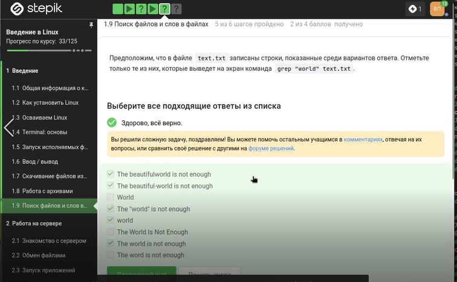

## Рис.32

- Ввожу нужные команды в терминал, чтобы сгенерировать файл, в котором будут все строчки из этих произведений, содержащие “love”

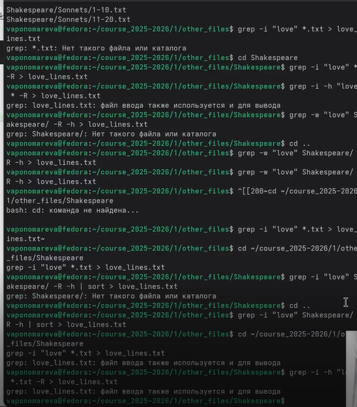

## Рис.33

- Загружаю этот файл на платформу

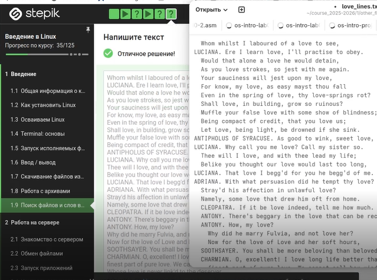

# Выводы

- Мы освоили базовые функции Linux и выполнили задания

