---
## Front matter
title: "Отчёт по выполнению внешнего курса. Этап 1"
subtitle: "Введение"
author: "Пономарева Варвара Александровна"

## Generic otions
lang: ru-RU
toc-title: "Содержание"

## Bibliography
bibliography: bib/cite.bib
csl: _resources/csl/gost-r-7-0-5-2008-numeric.csl

## Pdf output format
toc: true # Table of contents
toc-depth: 2
lof: true # List of figures
lot: false
fontsize: 12pt
linestretch: 1.5
papersize: a4
documentclass: scrreprt
## I18n polyglossia
polyglossia-lang:
  name: russian
  options:
   - spelling=modern
   - babelshorthands=true
polyglossia-otherlangs:
  name: english
## I18n babel
babel-lang: russian
babel-otherlangs: english
## Fonts
mainfont: Liberation Serif
sansfont: Liberation Sans
monofont: Liberation Mono
mainfontoptions: Ligatures=TeX
romanfontoptions: Ligatures=TeX
sansfontoptions: Ligatures=TeX,Scale=MatchLowercase
monofontoptions: Scale=MatchLowercase,Scale=0.9
## Biblatex
biblatex: true
biblio-style: "gost-numeric"
biblatexoptions:
  - parentracker=true
  - backend=biber
  - hyperref=auto
  - language=auto
  - autolang=other*
  - citestyle=gost-numeric
## Pandoc-crossref LaTeX customization
figureTitle: "Рис."
listingTitle: "Листинг"
lofTitle: "Список иллюстраций"
lolTitle: "Листинги"
## Misc options
indent: true
header-includes:
  - \usepackage{indentfirst}
  - \usepackage{float} # keep figures where there are in the text
  - \floatplacement{figure}{H} # keep figures where there are in the text
---
# Цель работы

Освоить базовые возможности Linux, выполнить задания и пройти 1 этап курса.

# Задание

Посмотреть все предложенные видео и правильно ответить на вопросы и выполнить задания.

# Выполнение внешнего курса

## 1.1 Общая информация о курсе

Выбираю правильное названия курса и отправляю ответ. ([рис. @fig-001]).

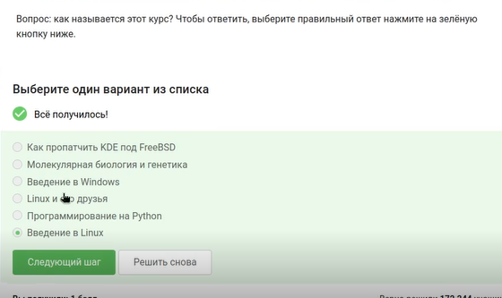{#fig-001 width=70%}

Выбираю нужные пункты и отправляю решение. ([рис. @fig-002]).

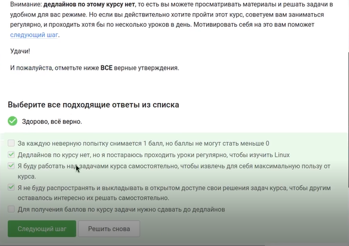{#fig-002 width=70%}

## 1.2 Как установить Linux

Отвечаю какими операционными системами я пользуюсь. ([рис. @fig-003]).

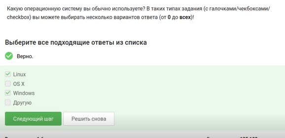{#fig-003 width=70%}

Для вопроса «Что такое виртуальная машина?» выбран наиболее полный ответ: «Специальная программа для запуска одной ОС на другой ОС». ([рис. @fig-004]).

{#fig-004 width=70%}

Отвечаю, что получилось запустить Linux и отправляю ответ ([рис. @fig-005]).

{#fig-005 width=70%}

## 1.3 Осваиваем Linux

Создаю документ в предложенном текстовом редакторе, выбираю нужный шрифт и ввожу предложение. ([рис. @fig-006]).

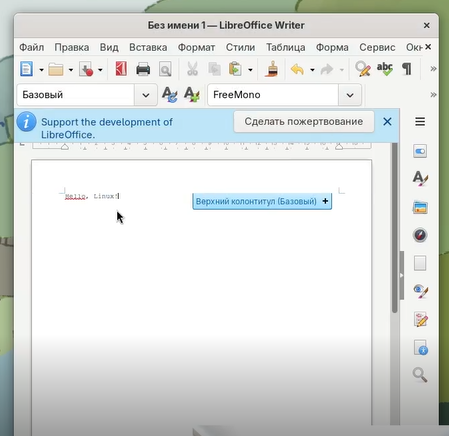{#fig-006 width=70%}

Сохраняю в формате xml и отправляю ответ. ([рис. @fig-007]).

{#fig-007 width=70%}

Выбираю нужное расширение deb, так как оно имеет установочные пакеты в Linux (Ubuntu). ([рис. @fig-008]).

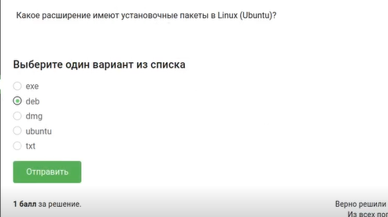{#fig-008 width=70%}

Прописываю команду sudo dnf install, чтобы скачать vcl. ([рис. @fig-009]).

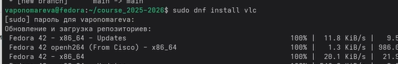{#fig-009 width=70%}

Открываю скачанную программу, захожу в авторов и ввожу фамилию самого первого. ([рис. @fig-010]).

{#fig-010 width=70%}

Для вопроса о назначении Update Manager выбраны правильные пункты: «Для обновления всей системы до новой версии» и «Для обновления ссылок в Software Center» (последнее — специфика данного теста).. ([рис. @fig-011]).

{#fig-011 width=70%}

## 1.4 Terminal: основы

Выбраны все синонимы для «командной строки»: «Терминал» и «Консоль». Варианты «Ассоль» и «Термин» не являются синонимами в данном контексте. ([рис. @fig-012]).

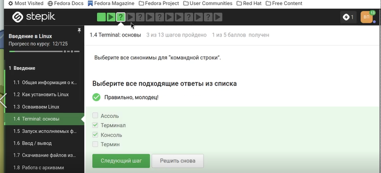{#fig-012 width=70%}

Выбираю pwd, потому что эта команда показывает в какой директории мы сейчас находимся. ([рис. @fig-013]).

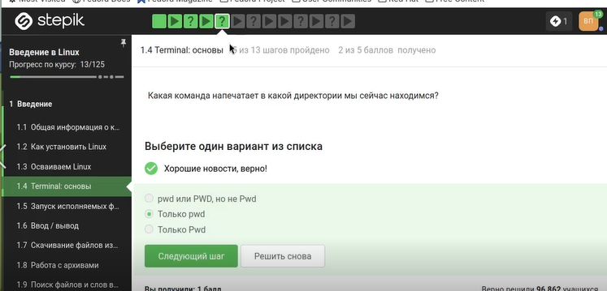{#fig-013 width=70%}

Для команды ls -A --human-readable -l /some/directory отмечены эквивалентные варианты: ls -lAh /some/directory, ls -Ahl /some/directory, ls -h -A -l /some/directory. Все они используют группировку опций -A (почти все файлы), -h (человеко‑читаемые размеры) и -l (длинный формат). ([рис. @fig-014]).

{#fig-014 width=70%}

Из директории /home/bi/Documents нужно вывести содержимое /home/bi/Downloads. Выбран верный относительный путь: ls ../Downloads (подъём на уровень вверх и переход в папку Downloads). Вариант с ls /home/bi/Do* не отмечен, так как вывел бы и Documents, и Downloads. ([рис. @fig-015]).

{#fig-015 width=70%}

Вопрос о команде удаления директорий. Правильный ответ — rm -r (рекурсивное удаление). mkdir создаёт, mv перемещает, rm -f удаляет файлы без подтверждения, но не директории. ([рис. @fig-016]).

{#fig-016 width=70%}

## 1.5 Запуск исполняемых файлов

Выбран верный вариант ответа. ([рис. @fig-017]).

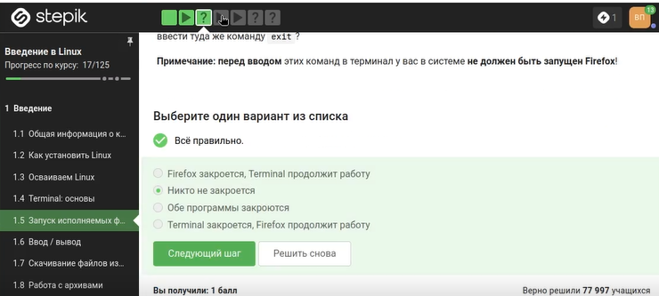{#fig-017 width=70%}

Запуск программы с символом & переводит её в фоновый режим. Этому эквивалентна последовательность: запуск программы, затем нажатие Ctrl+Z (остановка), затем команда bg (возобновление в фоне). ([рис. @fig-018]).

{#fig-018 width=70%}

Перехожу в нужную директорию и ввожу команды, чтобы файл сделать исполняемым. ([рис. @fig-019]).

{#fig-019 width=70%}

После запуска программа вывела на экран две строки: текущую дату и время (2026-04-19 14:37:16) и контрольную сумму (Control sum: 956). Этот текст скопирован в форму ответа, задание выполнено полностью. ([рис. @fig-020]).

{#fig-020 width=70%}

## 1.6 Ввод/вывод

Выбираю что поток ошибок выводится на экран. ([рис. @fig-021]).

{#fig-021 width=70%}

Выбраны команды, которые создают файл file.txt и записывают в него только поток ошибок (stderr) программы program: program 2> file.txt (перезапись) и program 2>> file.txt (добавление в конец). ([рис. @fig-022]).

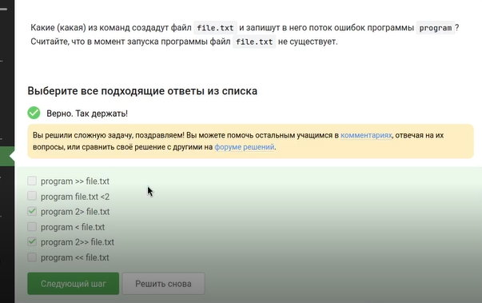{#fig-022 width=70%}

Вопрос о том, куда попадают сообщения об ошибках (stderr) в конвейере (pipe). Правильный ответ: «Выводятся на экран», потому что по умолчанию конвейер передаёт только stdout, а stderr остаётся на терминале ([рис. @fig-023]).

{#fig-023 width=70%}

## 1.7 Скачивание файлов из интернета

Выбираю правильный ответ. ([рис. @fig-024]).

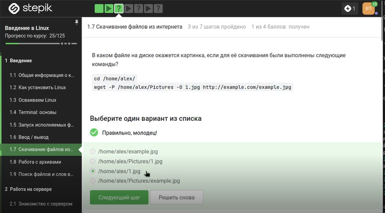{#fig-024 width=70%}

Для команды wget требуется опция, подавляющая вывод любых сообщений (Resolving..., Connecting to...). Правильный ответ: -q или --quiet (от английского quiet — тихий). Опции -v (verbose) и -nv (no-verbose) не отключают вывод полностью. ([рис. @fig-025]).

{#fig-025 width=70%}

В тесте выбран правильный сценарий работы wget с заданными опциями (например, рекурсивная загрузка с ограничением по типам файлов). ([рис. @fig-026]).

{#fig-026 width=70%}

## 1.8 Работа с архивами

Вопрос об отличии gzip от zip при использовании по умолчанию. Правильный ответ: gzip удаляет архив после его распаковки (если не использовать опцию -k). zip сохраняет архив после распаковки. ([рис. @fig-027]).

{#fig-027 width=70%}

Выбраны архиваторы, способные создать архив из директории: zip (может упаковать папку рекурсивно) и tar (создаёт tar-архив, который затем можно сжать). gzip сам по себе сжимает только один файл и не умеет упаковывать директорию без tar. ([рис. @fig-028]).

{#fig-028 width=70%}

Для распаковки архива .tar.gz используется комбинация опций tar -xzf: -x (extract), -z (через gzip), -f (файл). Другие варианты (-czf — создание, -xjf — для bz2, -wlf — несуществующая опция) не подходят. ([рис. @fig-029]).

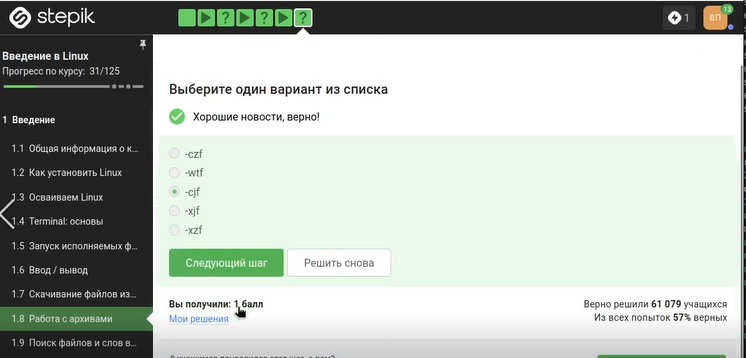{#fig-029 width=70%}

## 1.9 Поиск файлов и слов в файлах

Для файла Alexey.jpeg отмечены маски команды find, которые НЕ найдут этот файл: *.jpg (расширение .jpg, а не .jpeg) и alexey.* (имя с маленькой буквы, а в файле — с большой). Маски Alex*, *.*, Alexey.jpeg, *?* нашли бы файл. ([рис. @fig-030]).

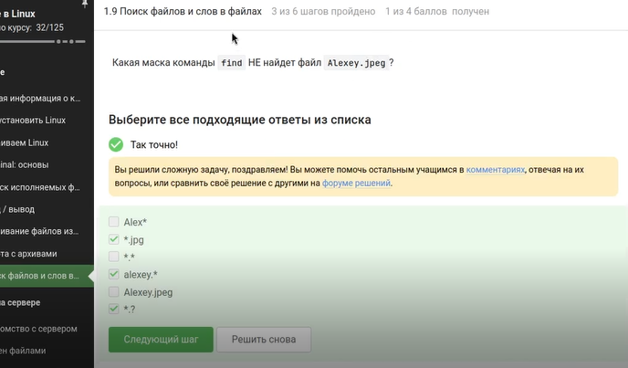{#fig-030 width=70%}

Команда grep "world" text.txt ищет точное вхождение world (с учётом регистра, если не указано -i). Выведены строки: The "world" is not enough, world, The world is not enough. Строки с World, The World Is Not Enough и другие варианты с заглавной буквы или дефисом не выводятся. ([рис. @fig-031]).

{#fig-031 width=70%}

Ввожу нужные команды в терминал, чтобы сгенерировать файл, в котором будут все строчки из этих произведений, содержащие “love” ([рис. @fig-032]).

{#fig-032 width=70%}

Загружаю этот файл на платформу. ([рис. @fig-033]).

{#fig-033 width=70%}

# Выводы

Мы освоили базовые функции Linux и выполнили задания.
