---
## Author
author:
  name: Пономарева Варвара Александровна
  degrees: DSc
  orcid: 0000-0002-0877-7063
  affiliation:
    - name: Российский университет дружбы народов
      country: Российская Федерация
      postal-code: 117198
      city: Москва
      address: ул. Миклухо-Маклая, д. 6
## Title
title: Отчёт по выполнению внешнего курса. Этап 2.
license: CC BY
date: today
date-format: "YYYY-MM-DD" # Example: 2025-09-06

## Fonts
mainfont: Liberation Serif
sansfont: Liberation Sans
monofont: Liberation Mono
mainfontoptions: Ligatures=TeX
romanfontoptions: Ligatures=TeX
sansfontoptions: Ligatures=TeX,Scale=MatchLowercase
monofontoptions: Scale=MatchLowercase,Scale=0.9
---

# Информация

## Докладчик

:::::::::::::: {.columns align=center}
::: {.column width="70%"}

  * Пономарева Варвара Александровна
  * студентка группы НПИ бд-02-25

:::
::: {.column width="30%"}

:::
::::::::::::::

# Цель работы

- Освоить базовые возможности работы с сервером, выполнить задания и пройти 2 этап курса

# Задание

- Посмотреть все предложенные видео и правильно ответить на вопросы и выполнить задания

# 2.1 Знакомство с сервером

## Рис.1

- Выбираю для каких задач можно использовать сервер и отправляю ответ

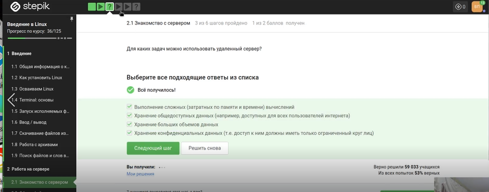

## Рис.2

- При SSH-аутентификации используется пара ключей: закрытый (id_rsa) и открытый (id_rsa.pub). Закрытый ключ должен храниться в секрете и никогда не передаваться

# 2.2 Обмен файлами

## Рис.3

- scp — команда для копирования по SSH, -r — рекурсивное копирование (нужно для папок),stepic — копируемая папка, username@server:~/ — пользователь, сервер и целевая директория (домашняя),Варианты с ssh неверны (ssh — для подключения, а не копирования). Вариант без -r скопирует только файлы верхнего уровня без подпапок

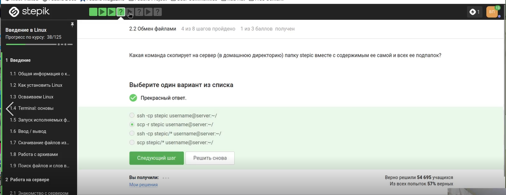

## Рис.4

- Ошибка «не может найти и скачать пакет» часто возникает из-за устаревшего списка пакетов. Команда apt-get update обновляет этот список

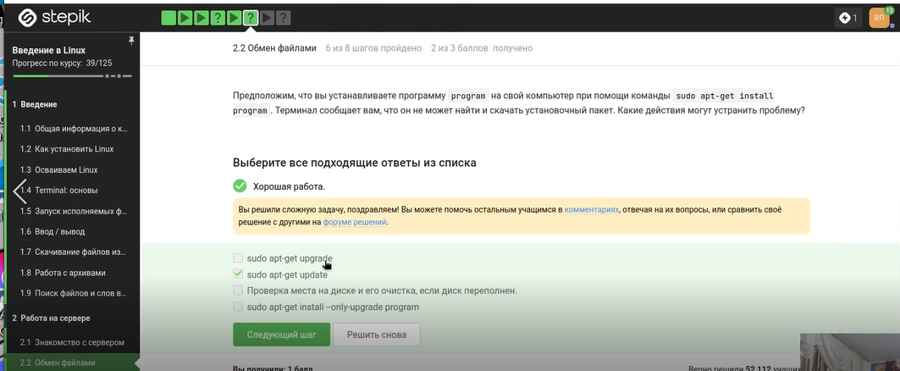

## Рис.5

- FileZilla — FTP-клиент. Его основные функции: просматривать файлы на сервере (правая панель), загружать файлы с компьютера на сервер и скачивать с сервера на компьютер. Он не предназначен для запуска программ на сервере или их установки — для этого нужен SSH

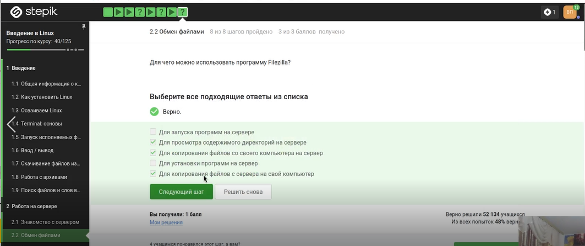

# 2.3 Запуск приложений

## Рис.6

- На сервере обычно нет графического экрана. Если программа требует GUI, есть два разумных решения: найти её консольный аналог (многие программы имеют -cli версию) или скопировать данные на локальный компьютер и запустить программу там. «Настроить сервер для вывода на экран» невозможно в обычном смысле, а «ничего сделать нельзя» — неверно, так как способы есть

## Рис.7

- program --help (или -h) выводит краткую справку. man program — полное руководство. Команда help program работает только для встроенных команд оболочки (например, help cd)

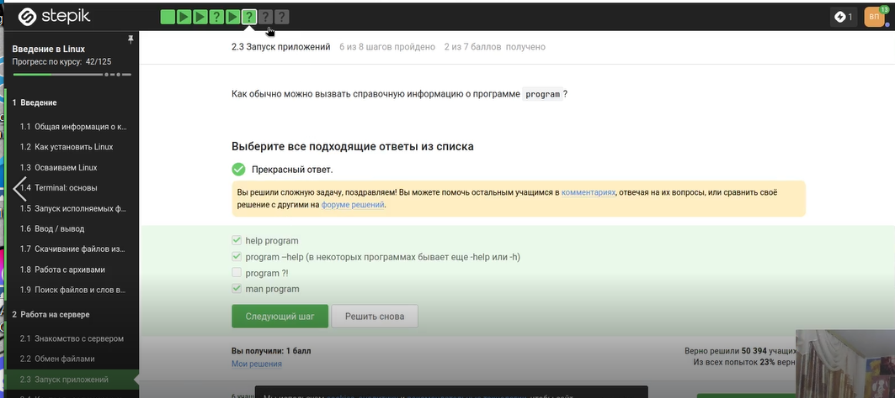

## Рис.8

- FastQC анализирует данные секвенирования. Основной входной формат — FASTQ (fastq). Также он умеет работать с BAM/SAM файлами, а опции bam_mapped / sam_mapped указывают анализировать только выравненные чтения. seq — не формат для FastQC, fastqc — название самой программы

## Рис.9

- ClustalW (или Clustal Omega) используется для множественного выравнивания последовательностей. Команда clustalw test.fasta -align означает: взять входной файл test.fasta и выполнить выравнивание. Синтаксис корректен для классической версии ClustalW

# 2.4 Контроль запускаемых программ

## Рис.10

- Исходно три программы запущены в фоне. fg %1 — program1 выводится на передний план. Ctrl+C — program1 завершается. fg %2 — program2 на переднем плане. Ctrl+Z — program2 останавливается (но остаётся в списке jobs). program3 всё это время был в фоне. Команда jobs показывает остановленные и фоновые процессы — это program2 (остановлен) и program3 (фон). program1 завершён и не показывается

## Рис.11

- Выбираю првильный ответ и отправляю его

## Рис.12

- kill -9 (сигнал SIGKILL) мгновенно завершает процесс, процесс не может его перехватить или игнорировать. Обычный kill (без опций) отправляет сигнал SIGTERM («вежливое» завершение), который процесс может обработать или проигнорировать

## Рис.13

- Процесс, остановленный Ctrl+Z, находится в состоянии «остановлен» (T). При отправке ему сигнала SIGTERM (обычный kill) он не завершается мгновенно, потому что остановлен. Он перейдёт в состояние «завершающийся» и завершится, когда будет продолжен. Но на практике в большинстве систем сигнал сохраняется, и процесс завершится при попытке его возобновить

# 2.5 Многопоточные приложения

## Рис.14

- При остановке процесса (Ctrl+Z) его состояние сохраняется в памяти. При возобновлении (fg или bg) процесс продолжает работу с того же места и потребляет столько же ресурсов CPU, сколько и до остановки. Он не сбрасывается до нуля

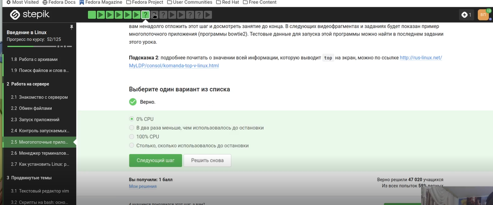

## Рис.15

- Остановка процесса через Ctrl+Z не освобождает выделенную ему память. Все данные остаются в оперативной памяти, процесс просто не получает процессорное время. Поэтому память остаётся занятой ровно в том объёме, который был на момент остановки

## Рис.16

- В Linux невозможно завершить один поток многопоточного процесса, не завершив весь процесс. Сигналы отправляются процессу в целом, а не отдельным потокам. Команд kill --thread или threadkill не существует

## Рис.17

- Скриншот показывает вывод команды bowtie2 --help. Видна справочная информация с описанием опций, включая -p/--threads для задания числа потоков

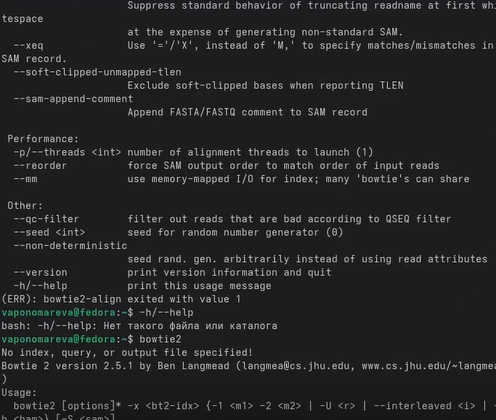

## Рис.18

- Команда bowtie2-build имеет опцию --threads для параллельного построения индекса. Команда bowtie2 имеет опцию -p/--threads для многопоточного выравнивания.

## Рис.19

- Перехожу в нужную директорию и ввожу команды, чтобы выполнить задание

## Рис.20

- Вывод показывает результат выравнивания: 306174 рида обработано, 100% выровнялось, 99.81% выровнялись ровно один раз

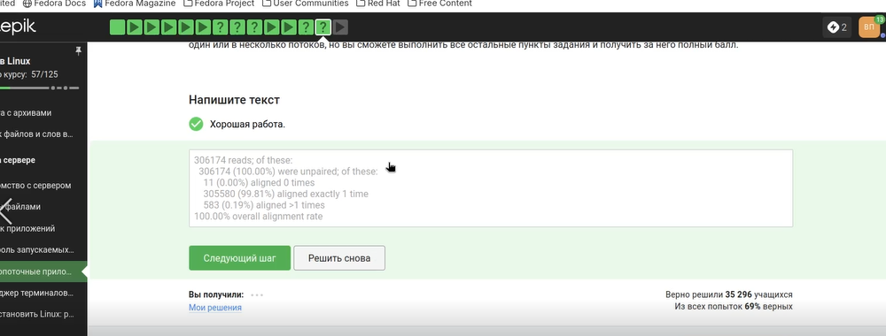

# 2.6 Менеджер терминалов tmux

## Рис.21

- Команда fg работает только в той терминальной сессии, где процесс был запущен. Если переключиться на другую вкладку (или в другой терминал), там не будет информации о процессе. Команда fg во второй вкладке либо выдаст ошибку «нет процесса», либо ничего не сделает

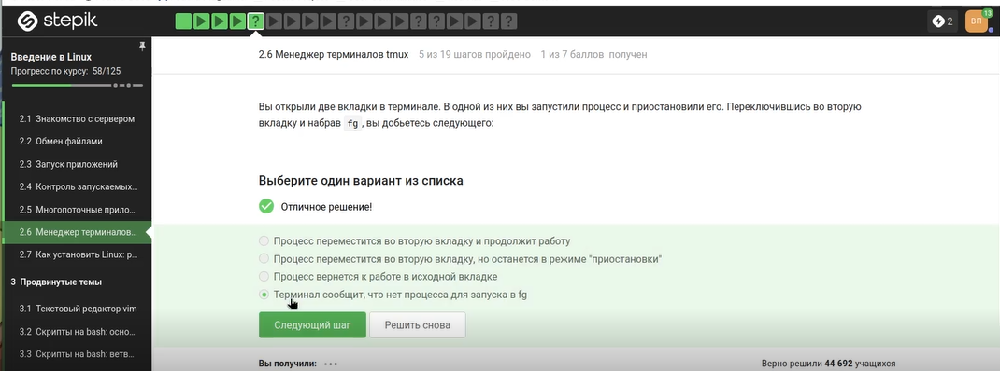

## Рис.22

- Если в сессии tmux осталась только одна вкладка (окно), и в ней выполнить exit (или закрыть последний процесс в ней), то эта вкладка закроется

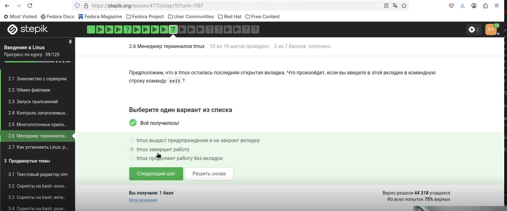

## Рис.23

- Это ключевая особенность tmux — он работает как серверный процесс независимо от терминального клиента. При обрыве SSH-соединения (закрытии терминала) tmux продолжает выполняться на сервере со всеми запущенными процессами

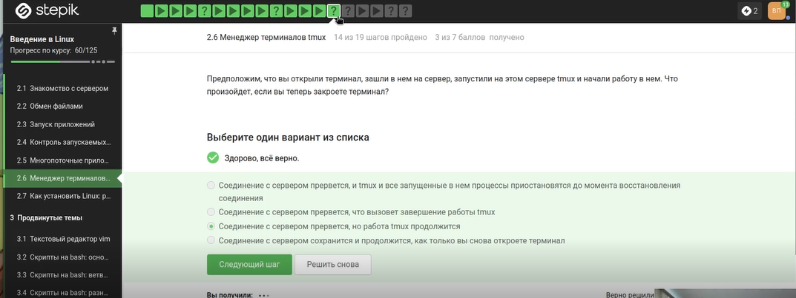

## Рис.24

- При принудительном закрытии вкладки (Ctrl+B, X) tmux завершает все процессы, запущенные в этой вкладке, включая фоновые. Процесс не переносится в другую вкладку и не сохраняется

## Рис.25

- На скриншоте показана часть справочной страницы man tmux

## Рис.26

- Выбираю правильный ответ на основе изученной справки и отправляю его на платфоому
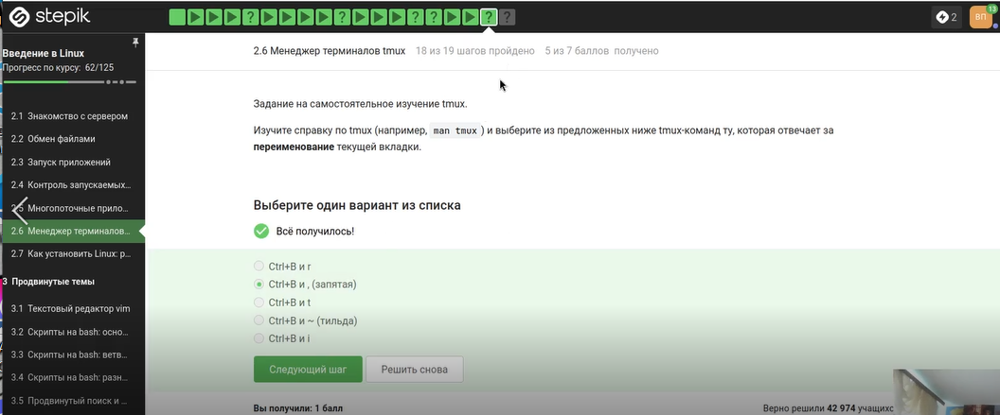

## Рис.27

- Запускаю tmux и проверяю на практике все утверждения

## Рис.28

- Многократное разделение — можно комбинировать горизонтальные и вертикальные сплиты сколько угодно раз. 3 части — горизонтальный сплит создаёт две панели (верх/низ). Вертикальный сплит в одной из них делит её на две, итого три панели (одна большая, две маленькие).Закрытие части — Ctrl+B, x закрывает текущую панель

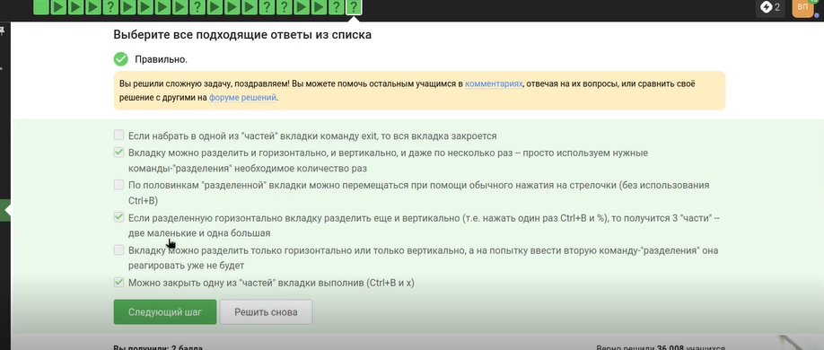

# 2.7 Как установить Linux: расширенное руководство

## Рис.29

- Просматриваю видео и читаю информацию, так как мне хватает вируальной машины для выполнения задас и на мрем компьюетере установлена другая ОС, то установка Linux не требуется

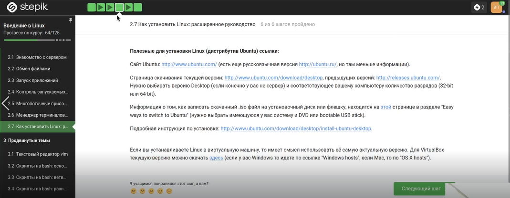

# Выводы

- Мы освоили базовые функции Linux и выполнили задания

