---
## Front matter
title: "Отчёт по выполнению внешнего курса. Этап 2"
subtitle: "Работа на сервере"
author: "Пономарева Варвара Александровна"

## Generic otions
lang: ru-RU
toc-title: "Содержание"

## Bibliography
bibliography: bib/cite.bib
csl: _resources/csl/gost-r-7-0-5-2008-numeric.csl

## Pdf output format
toc: true # Table of contents
toc-depth: 2
lof: true # List of figures
lot: false
fontsize: 12pt
linestretch: 1.5
papersize: a4
documentclass: scrreprt
## I18n polyglossia
polyglossia-lang:
  name: russian
  options:
   - spelling=modern
   - babelshorthands=true
polyglossia-otherlangs:
  name: english
## I18n babel
babel-lang: russian
babel-otherlangs: english
## Fonts
mainfont: Liberation Serif
sansfont: Liberation Sans
monofont: Liberation Mono
mainfontoptions: Ligatures=TeX
romanfontoptions: Ligatures=TeX
sansfontoptions: Ligatures=TeX,Scale=MatchLowercase
monofontoptions: Scale=MatchLowercase,Scale=0.9
## Biblatex
biblatex: true
biblio-style: "gost-numeric"
biblatexoptions:
  - parentracker=true
  - backend=biber
  - hyperref=auto
  - language=auto
  - autolang=other*
  - citestyle=gost-numeric
## Pandoc-crossref LaTeX customization
figureTitle: "Рис."
listingTitle: "Листинг"
lofTitle: "Список иллюстраций"
lolTitle: "Листинги"
## Misc options
indent: true
header-includes:
  - \usepackage{indentfirst}
  - \usepackage{float} # keep figures where there are in the text
  - \floatplacement{figure}{H} # keep figures where there are in the text
---
# Цель работы

Освоить базовые возможности работы с сервером, выполнить задания и пройти 2 этап курса.

# Задание

Посмотреть все предложенные видео и правильно ответить на вопросы и выполнить задания.

# Выполнение внешнего курса

## 2.1 Знакомство с сервером

Выбираю для каких задач можно использовать сервер и отправляю ответ. ([рис. @fig-001]).

{#fig-001 width=70%}

При SSH-аутентификации используется пара ключей: закрытый (id_rsa) и открытый (id_rsa.pub). Закрытый ключ должен храниться в секрете и никогда не передаваться. ([рис. @fig-002]).

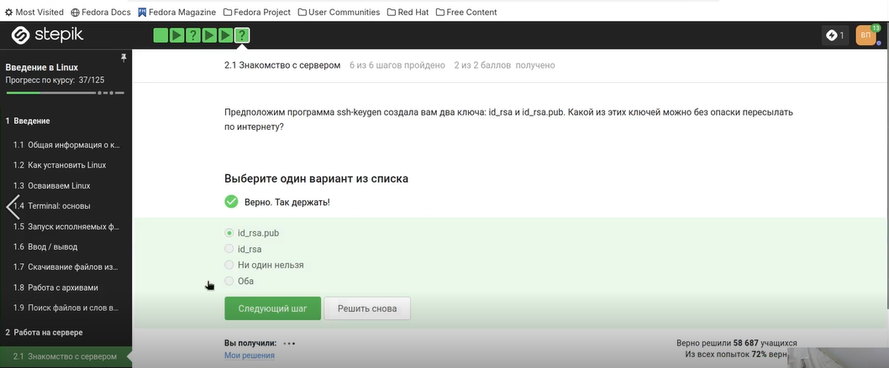{#fig-002 width=70%}

## 2.2 Обмен файлами

scp — команда для копирования по SSH, -r — рекурсивное копирование (нужно для папок),stepic — копируемая папка, username@server:~/ — пользователь, сервер и целевая директория (домашняя),Варианты с ssh неверны (ssh — для подключения, а не копирования). Вариант без -r скопирует только файлы верхнего уровня без подпапок. ([рис. @fig-003]).

{#fig-003 width=70%}

Ошибка «не может найти и скачать пакет» часто возникает из-за устаревшего списка пакетов. Команда apt-get update обновляет этот список. ([рис. @fig-004]).

{#fig-004 width=70%}

FileZilla — FTP-клиент. Его основные функции: просматривать файлы на сервере (правая панель), загружать файлы с компьютера на сервер и скачивать с сервера на компьютер. Он не предназначен для запуска программ на сервере или их установки — для этого нужен SSH. ([рис. @fig-005]).

{#fig-005 width=70%}

## 2.3 Запуск приложений

На сервере обычно нет графического экрана. Если программа требует GUI, есть два разумных решения: найти её консольный аналог (многие программы имеют -cli версию) или скопировать данные на локальный компьютер и запустить программу там. «Настроить сервер для вывода на экран» невозможно в обычном смысле, а «ничего сделать нельзя» — неверно, так как способы есть. ([рис. @fig-006]).

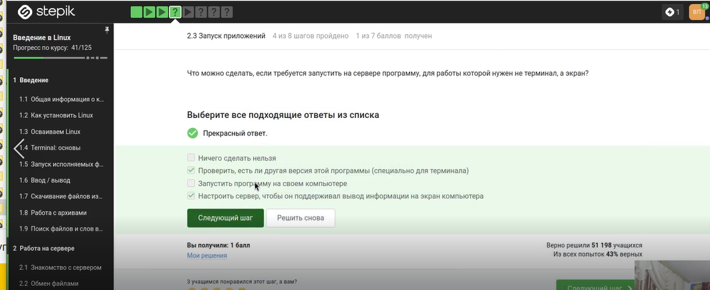{#fig-006 width=70%}

program --help (или -h) выводит краткую справку. man program — полное руководство. Команда help program работает только для встроенных команд оболочки (например, help cd). ([рис. @fig-007]).

{#fig-007 width=70%}

FastQC анализирует данные секвенирования. Основной входной формат — FASTQ (fastq). Также он умеет работать с BAM/SAM файлами, а опции bam_mapped / sam_mapped указывают анализировать только выравненные чтения. seq — не формат для FastQC, fastqc — название самой программы. ([рис. @fig-008]).

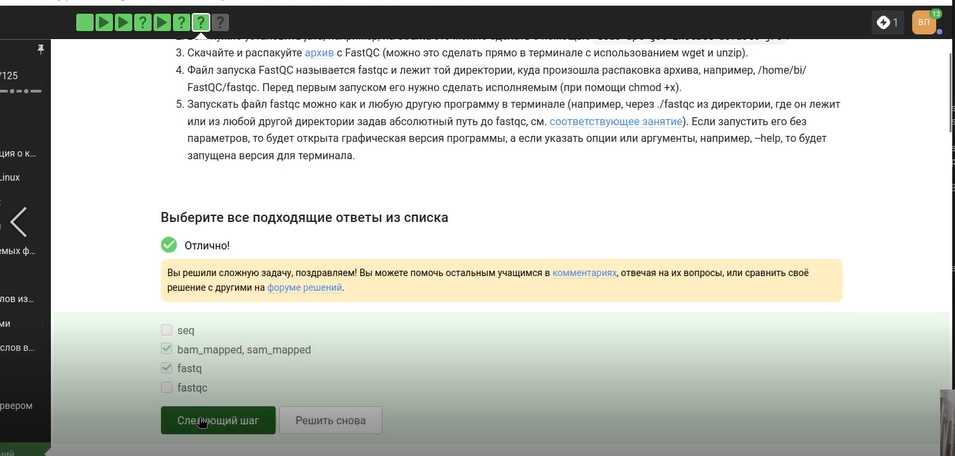{#fig-008 width=70%}

ClustalW (или Clustal Omega) используется для множественного выравнивания последовательностей. Команда clustalw test.fasta -align означает: взять входной файл test.fasta и выполнить выравнивание. Синтаксис корректен для классической версии ClustalW. ([рис. @fig-009]).

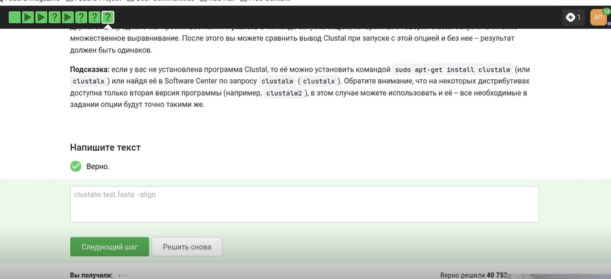{#fig-009 width=70%}

## 2.4 Контроль запускаемых программ

Исходно три программы запущены в фоне. fg %1 — program1 выводится на передний план. Ctrl+C — program1 завершается. fg %2 — program2 на переднем плане. Ctrl+Z — program2 останавливается (но остаётся в списке jobs). program3 всё это время был в фоне. Команда jobs показывает остановленные и фоновые процессы — это program2 (остановлен) и program3 (фон). program1 завершён и не показывается. ([рис. @fig-010]).

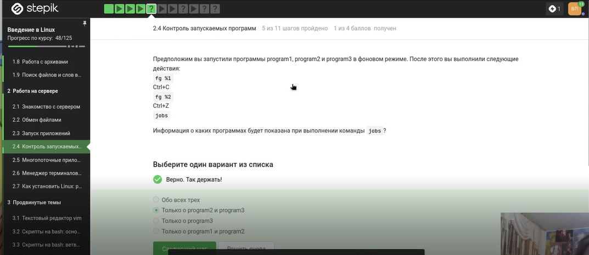{#fig-010 width=70%}

Выбираю првильный ответ и отправляю его. ([рис. @fig-011]).

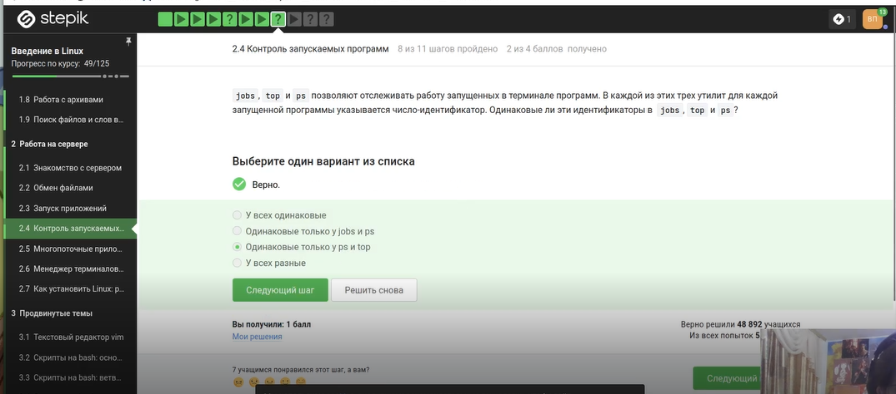{#fig-011 width=70%}

kill -9 (сигнал SIGKILL) мгновенно завершает процесс, процесс не может его перехватить или игнорировать. Обычный kill (без опций) отправляет сигнал SIGTERM («вежливое» завершение), который процесс может обработать или проигнорировать. ([рис. @fig-012]).

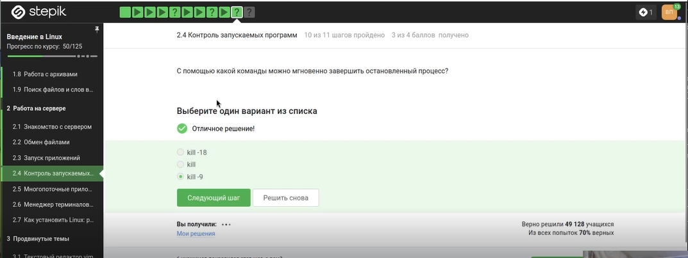{#fig-012 width=70%}

Процесс, остановленный Ctrl+Z, находится в состоянии «остановлен» (T). При отправке ему сигнала SIGTERM (обычный kill) он не завершается мгновенно, потому что остановлен. Он перейдёт в состояние «завершающийся» и завершится, когда будет продолжен. Но на практике в большинстве систем сигнал сохраняется, и процесс завершится при попытке его возобновить. ([рис. @fig-013]).

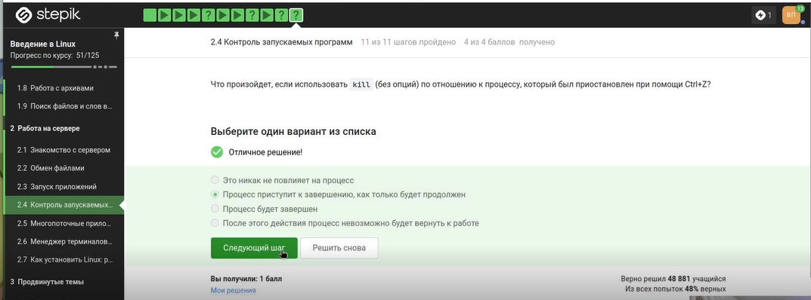{#fig-013 width=70%}

## 2.5 Многопоточные приложения

При остановке процесса (Ctrl+Z) его состояние сохраняется в памяти. При возобновлении (fg или bg) процесс продолжает работу с того же места и потребляет столько же ресурсов CPU, сколько и до остановки. Он не сбрасывается до нуля. ([рис. @fig-014]).

{#fig-014 width=70%}

Остановка процесса через Ctrl+Z не освобождает выделенную ему память. Все данные остаются в оперативной памяти, процесс просто не получает процессорное время. Поэтому память остаётся занятой ровно в том объёме, который был на момент остановки. ([рис. @fig-015]).

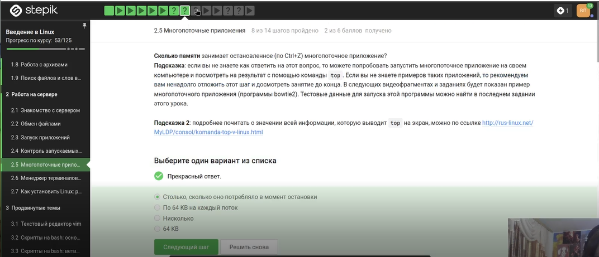{#fig-015 width=70%}

В Linux невозможно завершить один поток многопоточного процесса, не завершив весь процесс. Сигналы отправляются процессу в целом, а не отдельным потокам. Команд kill --thread или threadkill не существует. ([рис. @fig-016]).

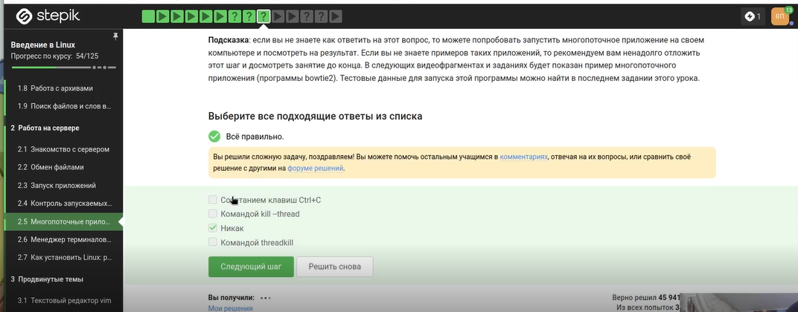{#fig-016 width=70%}

Скриншот показывает вывод команды bowtie2 --help. Видна справочная информация с описанием опций, включая -p/--threads для задания числа потоков. ([рис. @fig-017]).

{#fig-017 width=70%}

Команда bowtie2-build имеет опцию --threads для параллельного построения индекса. Команда bowtie2 имеет опцию -p/--threads для многопоточного выравнивания.  ([рис. @fig-018]).

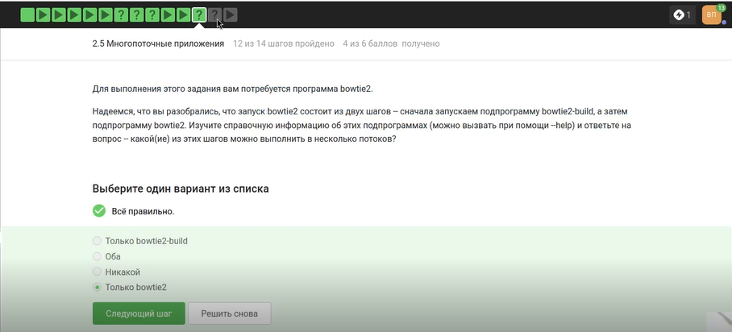{#fig-018 width=70%}

Перехожу в нужную директорию и ввожу команды, чтобы выполнить задание. ([рис. @fig-019]).

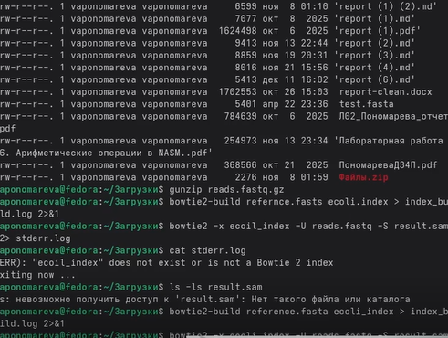{#fig-019 width=70%}

Вывод показывает результат выравнивания: 306174 рида обработано, 100% выровнялось, 99.81% выровнялись ровно один раз. ([рис. @fig-020]).

{#fig-020 width=70%}

## 2.6 Менеджер терминалов tmux

Команда fg работает только в той терминальной сессии, где процесс был запущен. Если переключиться на другую вкладку (или в другой терминал), там не будет информации о процессе. Команда fg во второй вкладке либо выдаст ошибку «нет процесса», либо ничего не сделает. ([рис. @fig-021]).

{#fig-021 width=70%}

Если в сессии tmux осталась только одна вкладка (окно), и в ней выполнить exit (или закрыть последний процесс в ней), то эта вкладка закроется. Поскольку вкладок больше нет, сессия завершается, и tmux прекращает работу. ([рис. @fig-022]).

{#fig-022 width=70%}

Это ключевая особенность tmux — он работает как серверный процесс независимо от терминального клиента. При обрыве SSH-соединения (закрытии терминала) tmux продолжает выполняться на сервере со всеми запущенными процессами. ([рис. @fig-023]).

{#fig-023 width=70%}

При принудительном закрытии вкладки (Ctrl+B, X) tmux завершает все процессы, запущенные в этой вкладке, включая фоновые. Процесс не переносится в другую вкладку и не сохраняется. ([рис. @fig-024]).

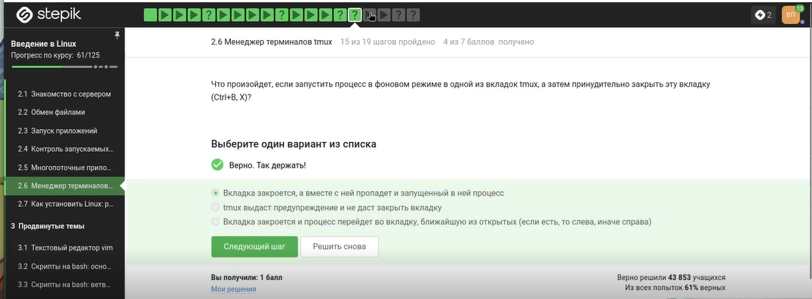{#fig-024 width=70%}

На скриншоте показана часть справочной страницы man tmux. ([рис. @fig-025]).

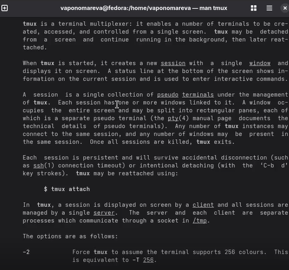{#fig-025 width=70%}

Выбираю правильный ответ на основе изученной справки и отправляю его на платфоому. ([рис. @fig-026]).

{#fig-026 width=70%}

Запускаю tmux и проверяю на практике все утверждения. ([рис. @fig-027]).

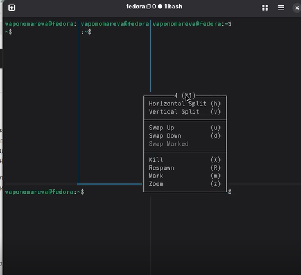{#fig-027 width=70%}

Многократное разделение — можно комбинировать горизонтальные и вертикальные сплиты сколько угодно раз. 3 части — горизонтальный сплит создаёт две панели (верх/низ). Вертикальный сплит в одной из них делит её на две, итого три панели (одна большая, две маленькие).Закрытие части — Ctrl+B, x закрывает текущую панель. ([рис. @fig-028]).

{#fig-028 width=70%}

## 2.7 Как установить Linux: расширенное руководство

Просматриваю видео и читаю информацию, так как мне хватает вируальной машины для выполнения задас и на мрем компьюетере установлена другая ОС, то установка Linux не требуется. ([рис. @fig-029]).

{#fig-029 width=70%}

# Выводы

Мы освоили базовые функции Linux и выполнили задания.
