---
## Author
author:
  name: Пономарева Варвара Александровна
  degrees: DSc
  orcid: 0000-0002-0877-7063
  affiliation:
    - name: Российский университет дружбы народов
      country: Российская Федерация
      postal-code: 117198
      city: Москва
      address: ул. Миклухо-Маклая, д. 6
## Title
title: Отчёт по выполнению внешнего курса. Этап 3.
license: CC BY
date: today
date-format: "YYYY-MM-DD" # Example: 2025-09-06

## Fonts
mainfont: Liberation Serif
sansfont: Liberation Sans
monofont: Liberation Mono
mainfontoptions: Ligatures=TeX
romanfontoptions: Ligatures=TeX
sansfontoptions: Ligatures=TeX,Scale=MatchLowercase
monofontoptions: Scale=MatchLowercase,Scale=0.9
---

# Информация

## Докладчик

:::::::::::::: {.columns align=center}
::: {.column width="70%"}

  * Пономарева Варвара Александровна
  * студентка группы НПИ бд-02-25

:::
::: {.column width="30%"}

:::
::::::::::::::

# Цель работы

- Освоить продвинутые возможности Linux, выполнить задания и пройти 3 этап курса.

# Задание

- Посмотреть все предложенные видео и правильно ответить на вопросы и выполнить задания.

# 3.1 Текстовый редактор vim

## Рис.1

- Выбираю ответ :q и затем Enter, так как именно эта команда в нормальном режиме позволит выйти из редактора если не было изменений

## Рис.2

- Выбираю именно этот пункт, потому что проверила в vim все утверждения

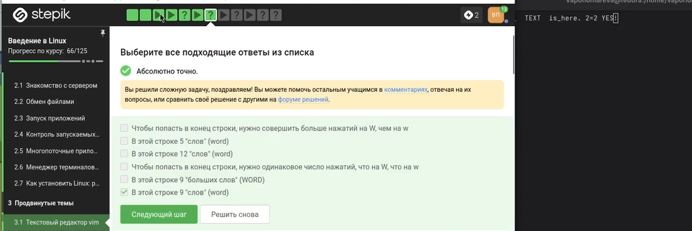

## Рис.3

- Из предложенных вариантов правильными признаны xxxxxxxxwyPp, d2w$bifour four Esc, d2wwywPp и d2wwifour four Esc, так как они преобразуют one two three four five в three four four four five.

## Рис.4

- Введена команда :%s/Windows/Linux/. Она заменяет только первое вхождение Windows в каждой строке, что соответствует условию

## Рис.5

- Верны: можно использовать d и y, можно использовать команды перемещения, внизу экрана появляется надпись -- VISUAL --. Нужно нажать v из нормального режима, а выходить — один раз Esc

# 3.2 Скрипты на bash: основы

## Рис.6

- Выбран ответ «Только из набора C». Каждая оболочка имеет свою историю, команды из родительских оболочек не видны

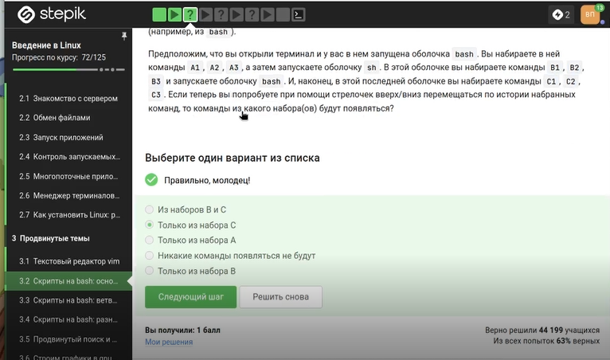

## Рис.7

- Выбран путь /home/bi/file1.txt, потому что touch file1.txt выполняется после cd /home/bi/, а последующая смена директории не перемещает файл

## Рис.8

- Правильные: variable123, variable, variable_123. Имя может начинаться с буквы или подчёркивания, содержать цифры не в начале

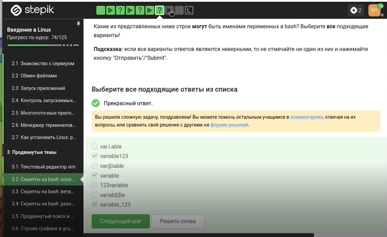

## Рис.9

- Скрипт выводит Arguments are: $1=первый $2=второй, используя $1 и $2. Знаки $ перед 1 и 2 экранированы для вывода буквально

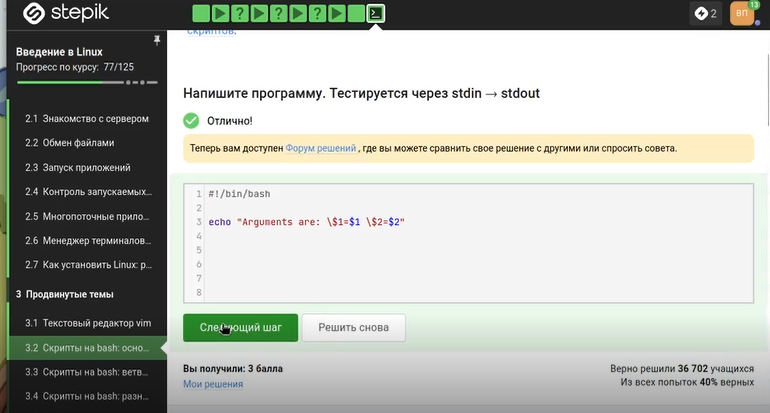

# 3.3 Скрипты на bash: ветвления и циклы

## Рис.10

- Проверяю команды в терминале и отмечаю те, которые вывели True

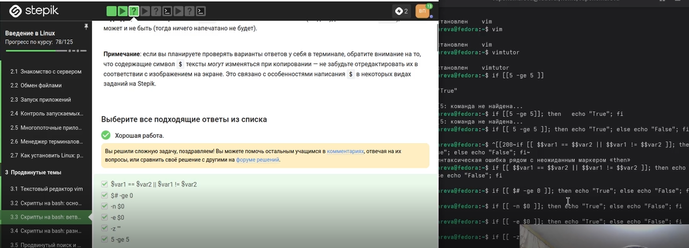

## Рис.11

- При var=3 выведет four, при var=5 — four

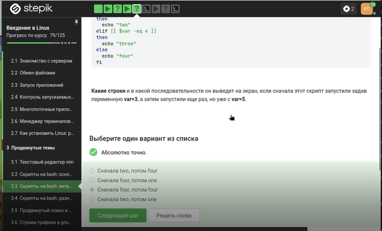

## Рис.12

- Скрипт выводит количество студентов: 0 → No students, 1 → 1 student, 2–4 → N students, остальное → A lot of students

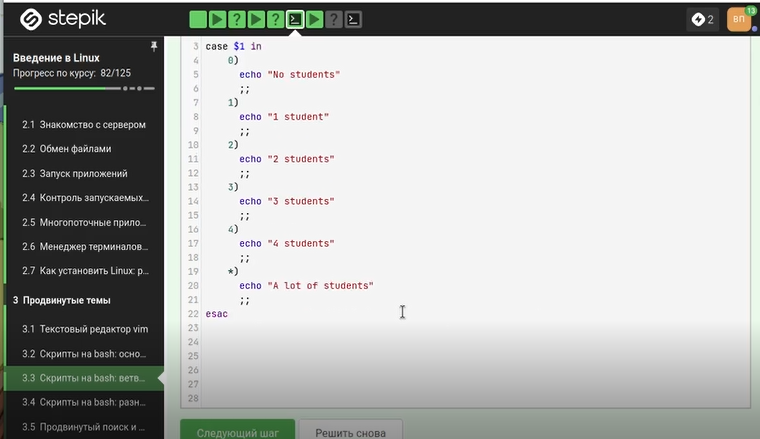

## Рис.13

- Цикл прошёл по трём элементам a, b, c_d, но из-за условия $str > "c" continue никогда не сработал, поэтому каждый раз выводились start и finish

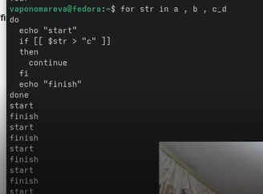

## Рис.14

- Цикл с for str in a, b, c_d дал несколько итерации, на каждой выводились start и finish

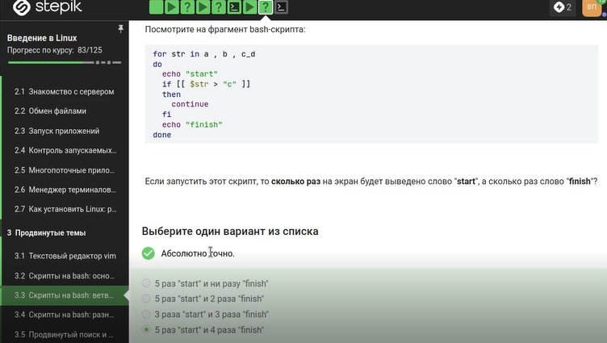

## Рис.15

- Скрипт определяет группу: до 10 — child, 17–25 — youth, остальные — adult. На скриншоте показан полный текст реализации

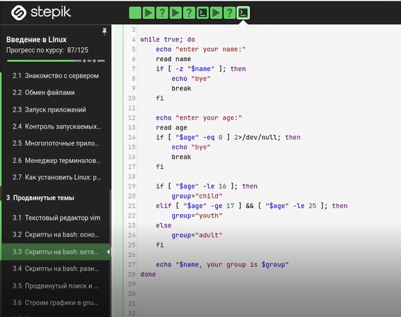

# 3.4 Скрипты на bash: разное

## Рис.16

- Правильные команды: let "a=$a+$b", let "a = a + b", let "a+=b". Знак $ нужен при чтении переменных, но не при присваивании

## Рис.17

- Выбран верный вариант ответ

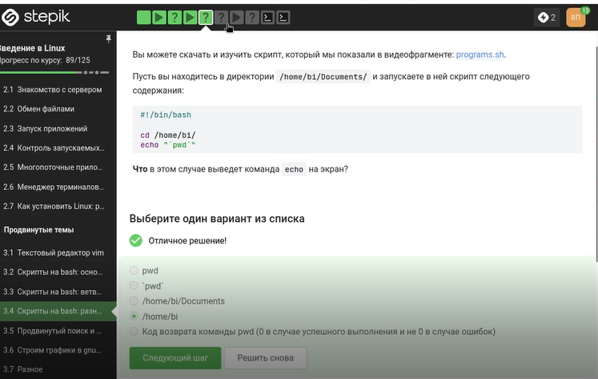

## Рис.18

- Выбраны два способа: сначала выполнить program, затем проверить $?; или сохранить вывод в переменную, затем проверить её

## Рис.19

- В функции c1 объявлена как local, поэтому глобальная c1 осталась равна 0. c2 глобальная накопила 110. Вывод: counters are 0 and 110

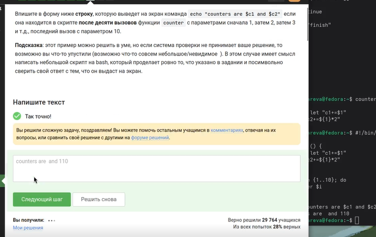

## Рис.20

- Пишу нужный код объясняю его

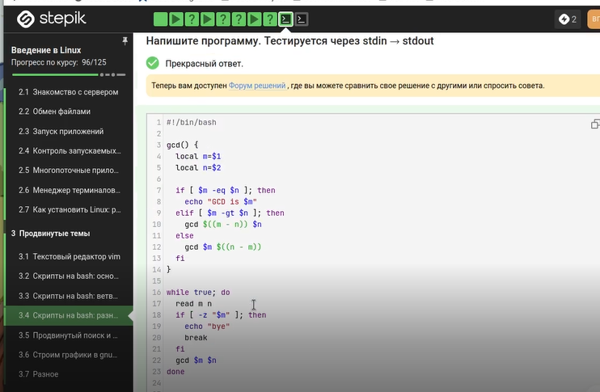

## Рис.21

- Пишу нужный код объясняю его

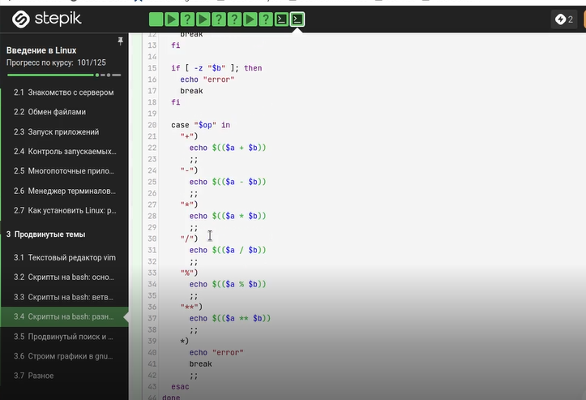

# 3.5 Продвинутый поиск и редактирование 

## Рис.22

- iname "star*" нашёл Star_Wars.avi, STARS.txt (регистронезависимо), а -name "star*" — только star_trek_0ST.mp3 и stardust.mpeg

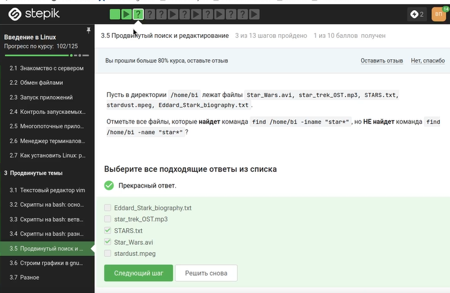

## Рис.23

- Верно: «find с -name найдёт меньше файлов, чем с -path». -path проверяет весь путь и может найти больше совпадений

## Рис.24

- mindepth 2 -maxdepth 3 находит файлы на глубине 2 и 3. file1 на глубине 2, file2 на глубине 3, file3 на глубине 4 — не найден

## Рис.25

- Если слово есть в каждой строке, все четыре команды выведут все 10 строк. Выбран ответ: results.txt будет одинакового размера

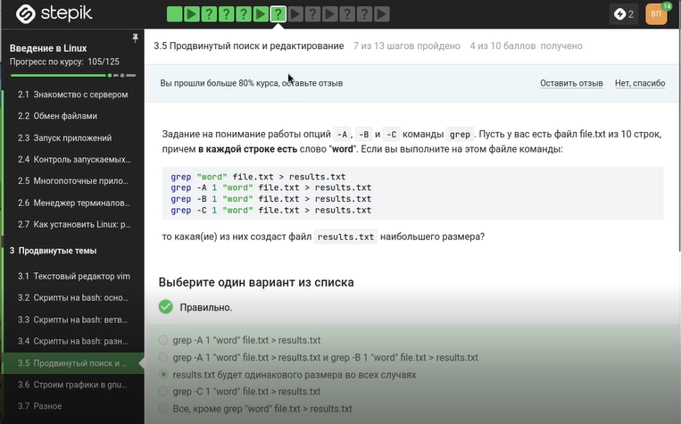

## Рис.26

- Выражение [xklXKL]?[uU]buntu$ находит строки, оканчивающиеся на buntu с возможной одной буквой из набора. Подходят Lubuntu is better than Ubuntu и The best OS is Xubuntu

## Рис.27

- Без -n sed печатает каждую строку автоматически, а команда p печатает ещё раз. Выбран ответ: каждая строка будет выведена два раза

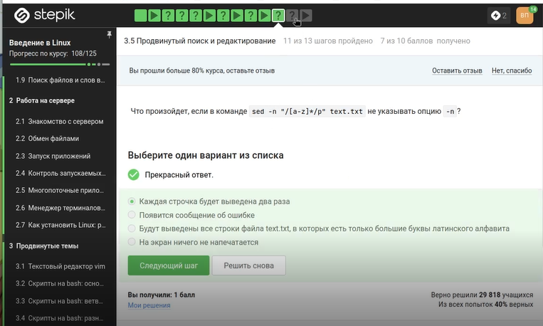

# 3.6 Строим графики в gnuplot 

## Рис.28

- Опция -p или --persist оставляет окна с графиками открытыми после выхода из gnuplot

## Рис.29

- set key autotitle columnhead использует первую строку данных как заголовок и исключает её из построения. Название — первое значение из второго столбца, точек — 9

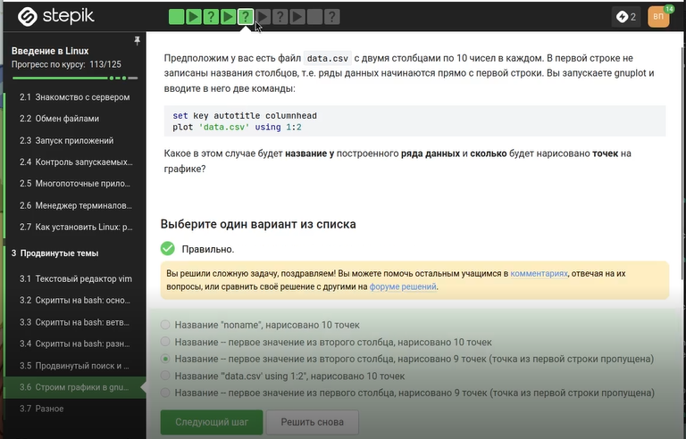

## Рис.30

- Правильная команда: set xtics ("point 1, value ".x1 x1, "point 2, value ".x2 x2, "point 3, value ".x3 x3). Конкатенация через . создаёт нужные подписи

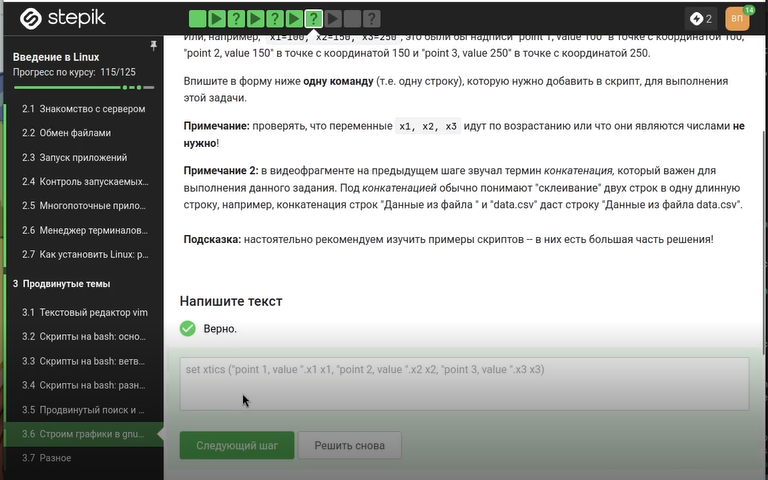

## Рис.31

- Файл изменён: отражение через -x**2-y**2, обратное вращение через +350, ускорение через pause 0.1

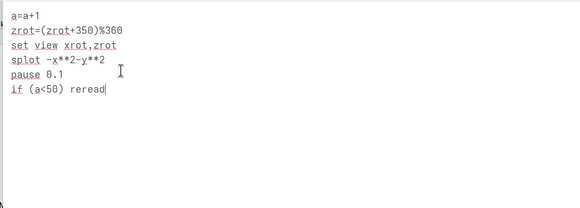

## Рис.32

- Файл move_rot (89 байт) успешно загружен на Stepik

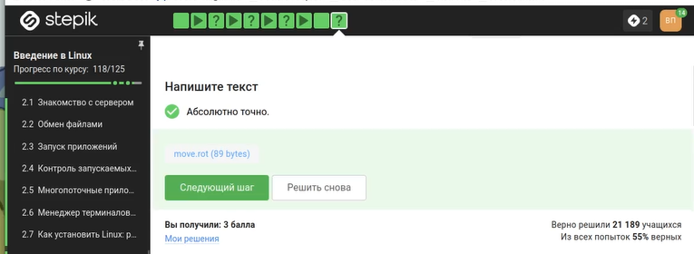

# 3.7 Разное

## Рис.33

- Нужно получить rwx r-x r--. Верные способы: chmod u+wx; chmod g+w и chmod 764 (7=rwx, 6=rw-, 4=r--)

## Рис.34

- Команды sudo chmod o+w dir, sudo chmod a+w dir, sudo chown user dir, sudo chown user:group dir — верны

## Рис.35

- wc считает строки, слова, байты и длину самой длинной строки. Выбраны все эти характеристики

## Рис.36

- Команда du -sh выводит размер текущей директории в человеко-читаемом формате без лишней информации

## Рис.37

- Самая короткая команда: mkdir dir{1..3}. Фигурные скобки создают dir1, dir2, dir3

# Выводы

- Мы освоили продвинутые функции Linux и выполнили задания

