---
## Front matter
title: "Отчёт по выполнению внешнего курса. Этап 3"
subtitle: "Продвинутые темы"
author: "Пономарева Варвара Александровна"

## Generic otions
lang: ru-RU
toc-title: "Содержание"

## Bibliography
bibliography: bib/cite.bib
csl: _resources/csl/gost-r-7-0-5-2008-numeric.csl

## Pdf output format
toc: true # Table of contents
toc-depth: 2
lof: true # List of figures
lot: false
fontsize: 12pt
linestretch: 1.5
papersize: a4
documentclass: scrreprt
## I18n polyglossia
polyglossia-lang:
  name: russian
  options:
   - spelling=modern
   - babelshorthands=true
polyglossia-otherlangs:
  name: english
## I18n babel
babel-lang: russian
babel-otherlangs: english
## Fonts
mainfont: Liberation Serif
sansfont: Liberation Sans
monofont: Liberation Mono
mainfontoptions: Ligatures=TeX
romanfontoptions: Ligatures=TeX
sansfontoptions: Ligatures=TeX,Scale=MatchLowercase
monofontoptions: Scale=MatchLowercase,Scale=0.9
## Biblatex
biblatex: true
biblio-style: "gost-numeric"
biblatexoptions:
  - parentracker=true
  - backend=biber
  - hyperref=auto
  - language=auto
  - autolang=other*
  - citestyle=gost-numeric
## Pandoc-crossref LaTeX customization
figureTitle: "Рис."
listingTitle: "Листинг"
lofTitle: "Список иллюстраций"
lolTitle: "Листинги"
## Misc options
indent: true
header-includes:
  - \usepackage{indentfirst}
  - \usepackage{float} # keep figures where there are in the text
  - \floatplacement{figure}{H} # keep figures where there are in the text
---
# Цель работы

Освоить углубленные возможности Linux, выполнить задания и пройти 1 этап курса.

# Задание

Посмотреть все предложенные видео и правильно ответить на вопросы и выполнить задания.

# Выполнение внешнего курса

## 3.1 Текстовый редактор vim

Выбираю ответ :q и затем Enter, так как именно эта команда в нормальном режиме позволит выйти из редактора если не было изменений. ([рис. @fig-001]).

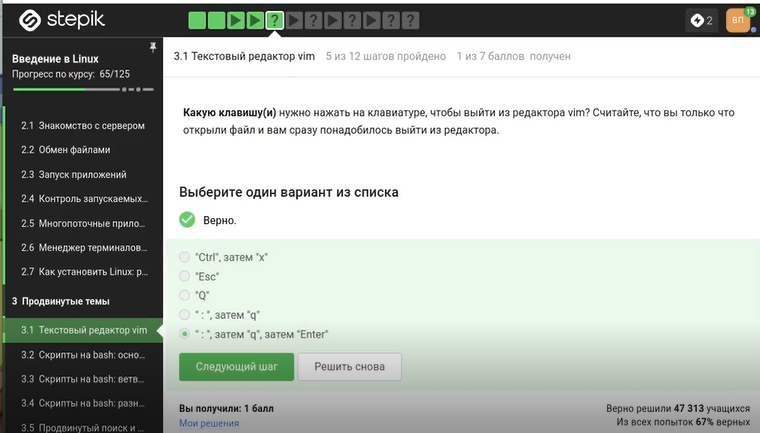{#fig-001 width=70%}

Выбираю именно этот пункт, потому что проверила в vim все утверждения. ([рис. @fig-002]).

{#fig-002 width=70%}

Из предложенных вариантов правильными признаны xxxxxxxxwyPp, d2w$bifour four Esc, d2wwywPp и d2wwifour four Esc, так как они преобразуют one two three four five в three four four four five. ([рис. @fig-003]).

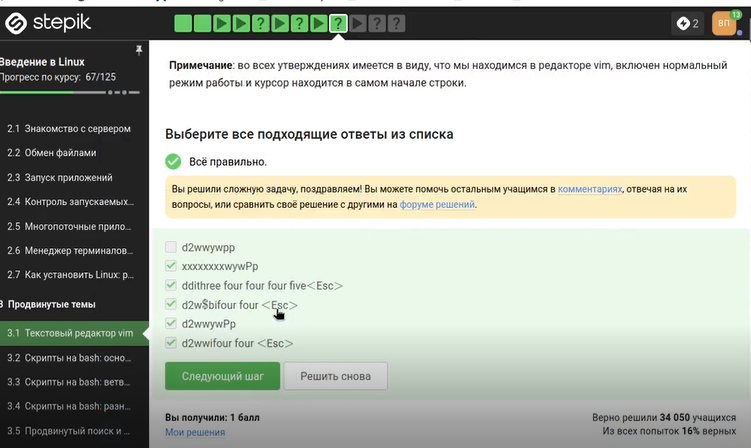{#fig-003 width=70%}

Введена команда :%s/Windows/Linux/. Она заменяет только первое вхождение Windows в каждой строке, что соответствует условию. ([рис. @fig-004]).

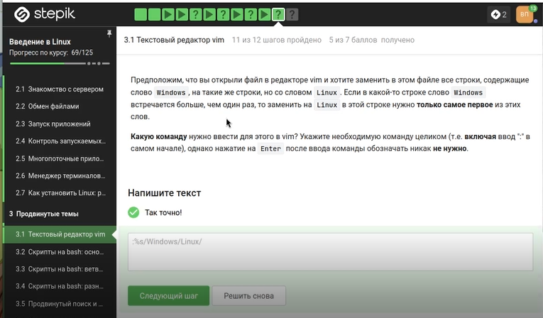{#fig-004 width=70%}

Верны: можно использовать d и y, можно использовать команды перемещения, внизу экрана появляется надпись -- VISUAL --. Нужно нажать v из нормального режима, а выходить — один раз Esc. ([рис. @fig-005]).

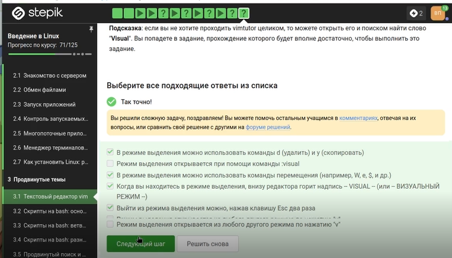{#fig-005 width=70%}

## 3.2 Скрипты на bash: основы

Выбран ответ «Только из набора C». Каждая оболочка имеет свою историю, команды из родительских оболочек не видны. ([рис. @fig-006]).

{#fig-006 width=70%}

Выбран путь /home/bi/file1.txt, потому что touch file1.txt выполняется после cd /home/bi/, а последующая смена директории не перемещает файл. ([рис. @fig-007]).

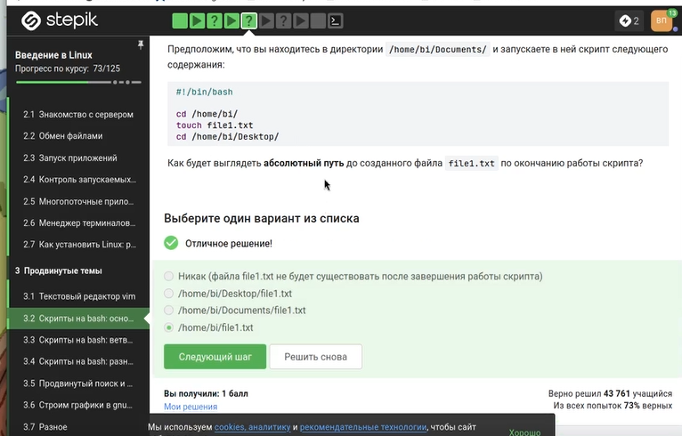{#fig-007 width=70%}

Правильные: variable123, variable, variable_123. Имя может начинаться с буквы или подчёркивания, содержать цифры не в начале. ([рис. @fig-008]).

{#fig-008 width=70%}

Скрипт выводит Arguments are: $1=первый $2=второй, используя $1 и $2. Знаки $ перед 1 и 2 экранированы для вывода буквально. ([рис. @fig-009]).

{#fig-009 width=70%}

## 3.3 Скрипты на bash: ветвления и циклы

Проверяю команды в терминале и отмечаю те, которые вывели True. ([рис. @fig-010]).

{#fig-010 width=70%}

При var=3 выведет four, при var=5 — four. ([рис. @fig-011]).

{#fig-011 width=70%}

Скрипт выводит количество студентов: 0 → No students, 1 → 1 student, 2–4 → N students, остальное → A lot of students. ([рис. @fig-012]).

{#fig-012 width=70%}

Цикл прошёл по трём элементам a, b, c_d, но из-за условия $str > "c" continue никогда не сработал, поэтому каждый раз выводились start и finish. ([рис. @fig-013]).

{#fig-013 width=70%}

Цикл с for str in a, b, c_d дал несколько итерации, на каждой выводились start и finish. ([рис. @fig-014]).

{#fig-014 width=70%}

Скрипт определяет группу: до 10 — child, 17–25 — youth, остальные — adult. На скриншоте показан полный текст реализации. ([рис. @fig-015]).

{#fig-015 width=70%}

## 3.4 Скрипты на bash: разное

Правильные команды: let "a=$a+$b", let "a = a + b", let "a+=b". Знак $ нужен при чтении переменных, но не при присваивании. ([рис. @fig-016]).

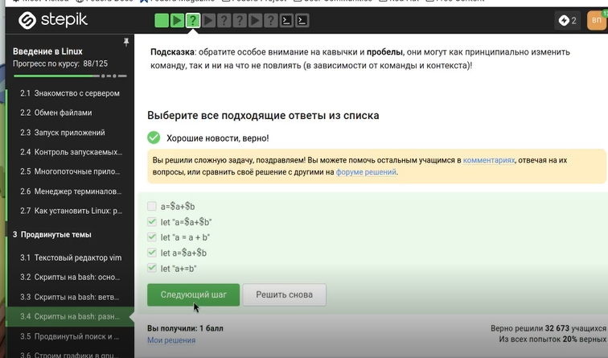{#fig-016 width=70%}

Выбран верный вариант ответа. ([рис. @fig-017]).

{#fig-017 width=70%}

Выбраны два способа: сначала выполнить program, затем проверить $?; или сохранить вывод в переменную, затем проверить её. ([рис. @fig-018]).

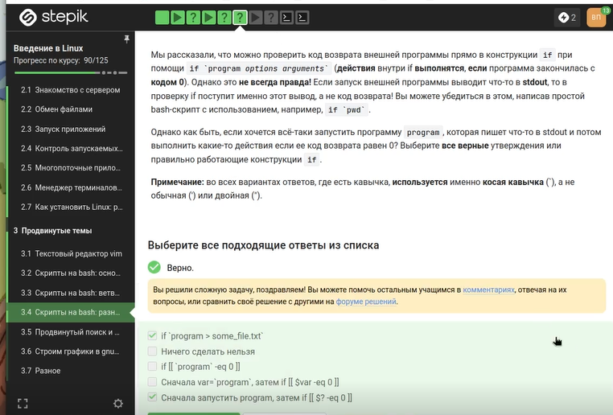{#fig-018 width=70%}

В функции c1 объявлена как local, поэтому глобальная c1 осталась равна 0. c2 глобальная накопила 110. Вывод: counters are 0 and 110. ([рис. @fig-019]).

{#fig-019 width=70%}

Пишу нужный код объясняю его. ([рис. @fig-020]).

{#fig-020 width=70%}

Пишу нужный код объясняю его. ([рис. @fig-021]).

{#fig-021 width=70%}

## 3.5 Продвинутый поиск и редактирование 

-iname "star*" нашёл Star_Wars.avi, STARS.txt (регистронезависимо), а -name "star*" — только star_trek_0ST.mp3 и stardust.mpeg. ([рис. @fig-022]).

{#fig-022 width=70%}

Верно: «find с -name найдёт меньше файлов, чем с -path». -path проверяет весь путь и может найти больше совпадений. ([рис. @fig-023]).

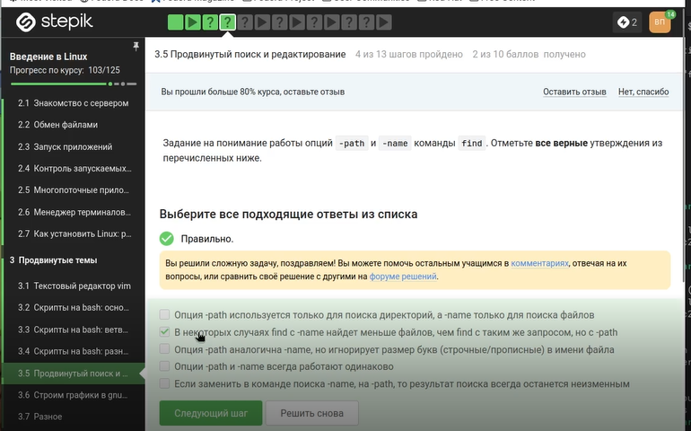{#fig-023 width=70%}

-mindepth 2 -maxdepth 3 находит файлы на глубине 2 и 3. file1 на глубине 2, file2 на глубине 3, file3 на глубине 4 — не найден. ([рис. @fig-024]).

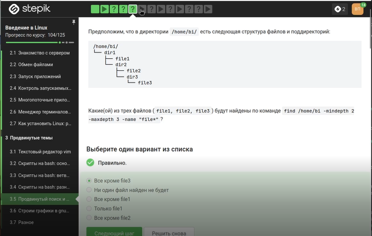{#fig-024 width=70%}

Если слово есть в каждой строке, все четыре команды выведут все 10 строк. Выбран ответ: results.txt будет одинакового размера. ([рис. @fig-025]).

{#fig-025 width=70%}

Выражение [xklXKL]?[uU]buntu$ находит строки, оканчивающиеся на buntu с возможной одной буквой из набора. Подходят Lubuntu is better than Ubuntu и The best OS is Xubuntu. ([рис. @fig-026]).

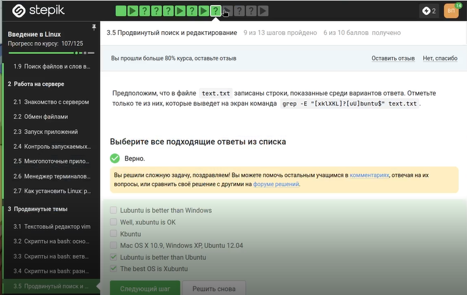{#fig-026 width=70%}

Без -n sed печатает каждую строку автоматически, а команда p печатает ещё раз. Выбран ответ: каждая строка будет выведена два раза. ([рис. @fig-027]).

{#fig-027 width=70%}

## 3.6 Строим графики в gnuplot 

Опция -p или --persist оставляет окна с графиками открытыми после выхода из gnuplot. ([рис. @fig-028]).

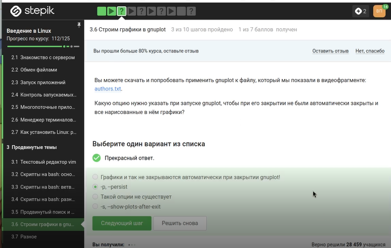{#fig-028 width=70%}

set key autotitle columnhead использует первую строку данных как заголовок и исключает её из построения. Название — первое значение из второго столбца, точек — 9. ([рис. @fig-029]).

{#fig-029 width=70%}

Правильная команда: set xtics ("point 1, value ".x1 x1, "point 2, value ".x2 x2, "point 3, value ".x3 x3). Конкатенация через . создаёт нужные подписи. ([рис. @fig-030]).

{#fig-030 width=70%}

Файл изменён: отражение через -x**2-y**2, обратное вращение через +350, ускорение через pause 0.1. ([рис. @fig-031]).

{#fig-031 width=70%}

Файл move_rot (89 байт) успешно загружен на Stepik. ([рис. @fig-032]).

{#fig-032 width=70%}

## 3.7 Разное

Нужно получить rwx r-x r--. Верные способы: chmod u+wx; chmod g+w и chmod 764 (7=rwx, 6=rw-, 4=r--). ([рис. @fig-033]).

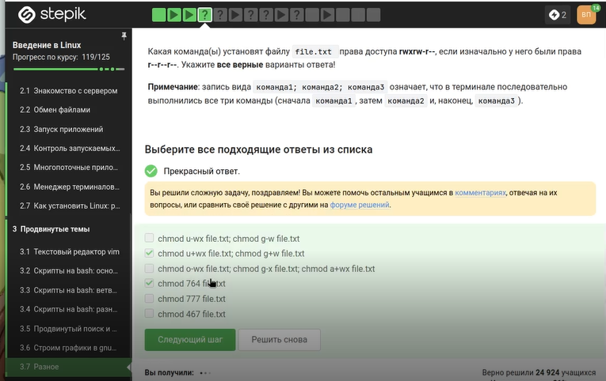{#fig-033 width=70%}

Команды sudo chmod o+w dir, sudo chmod a+w dir, sudo chown user dir, sudo chown user:group dir — верны. ([рис. @fig-034]).

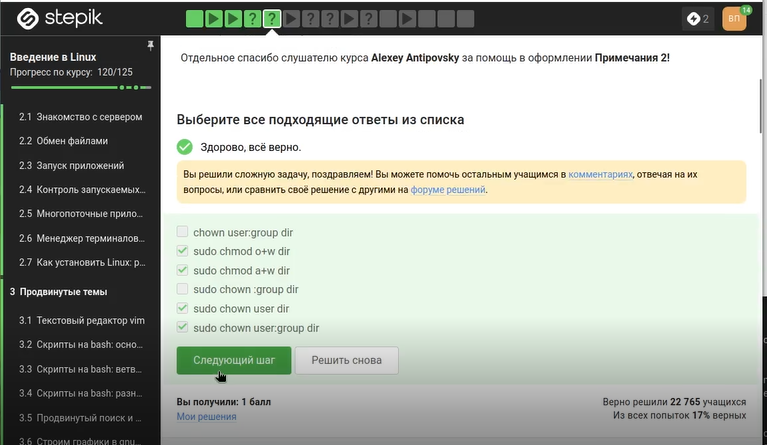{#fig-034 width=70%}

wc считает строки, слова, байты и длину самой длинной строки. Выбраны все эти характеристики. ([рис. @fig-035]).

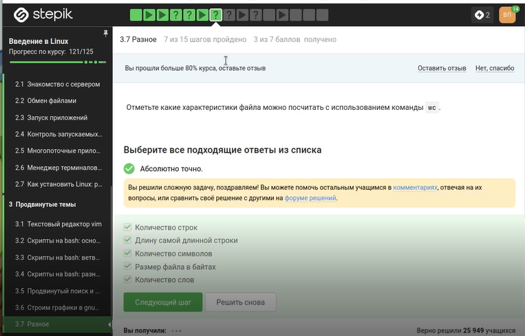{#fig-035 width=70%}

Команда du -sh выводит размер текущей директории в человеко-читаемом формате без лишней информации. ([рис. @fig-036]).

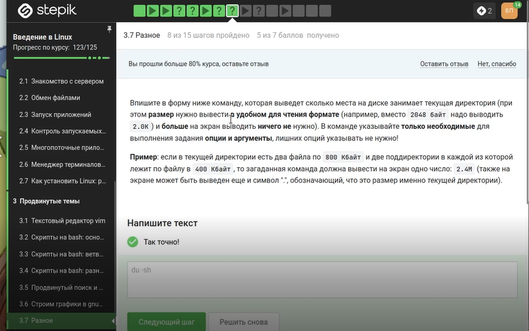{#fig-036 width=70%}

Самая короткая команда: mkdir dir{1..3}. Фигурные скобки создают dir1, dir2, dir3. ([рис. @fig-037]).

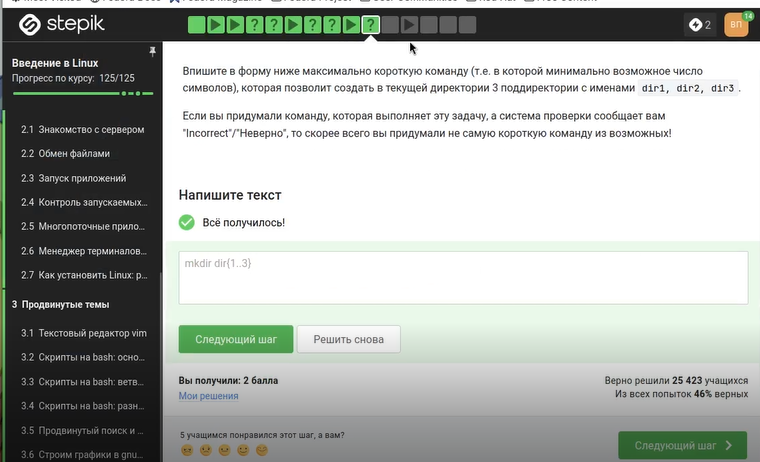{#fig-037 width=70%}

# Выводы

Мы освоили углубленные функции Linux и выполнили задания.
